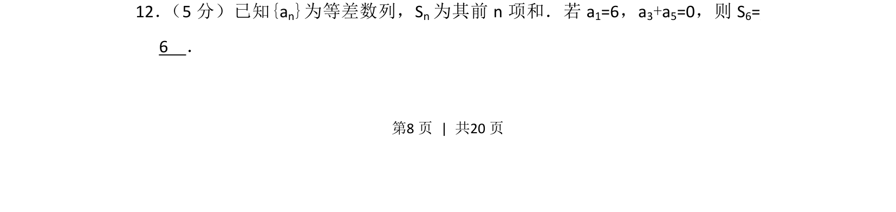
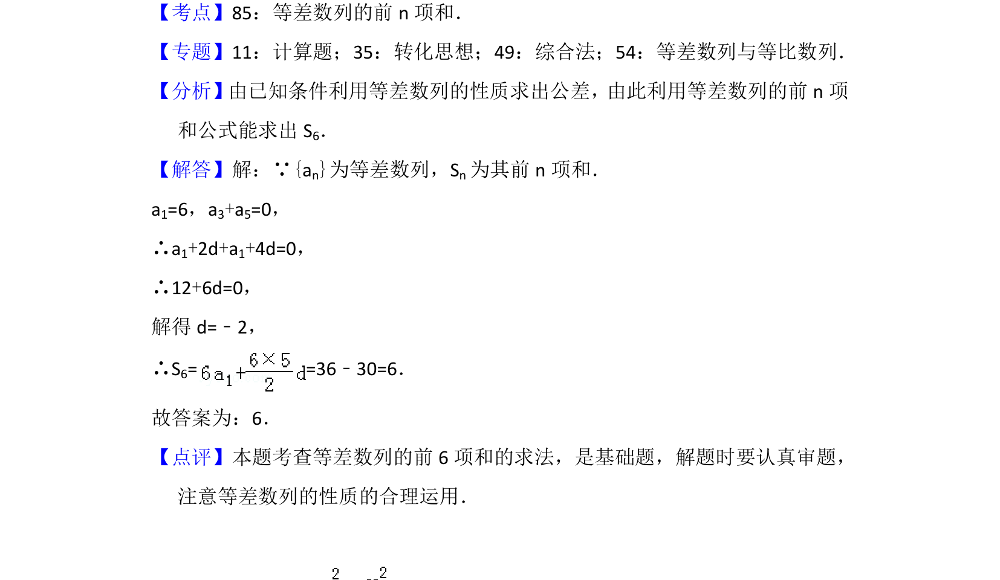

## 题面

## 摘要

等差数列已知首项及特定项和求前6项和，需解公差后套求和公式。

## 关联考点

- [[356-等差数列概念|等差数列]]
- [[384-数列通项公式|通项公式]]
- [[355-等差数列前n项和|前n项和]]

## 答案与解析

> 📄 原 PDF 第 8 页：`素材/真题/北京/2008-2024·（北京）数学高考真题/2016年高考数学试卷（理）（北京）（解析卷）.pdf`
