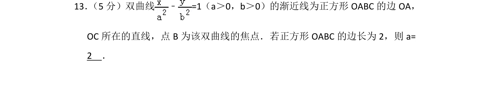
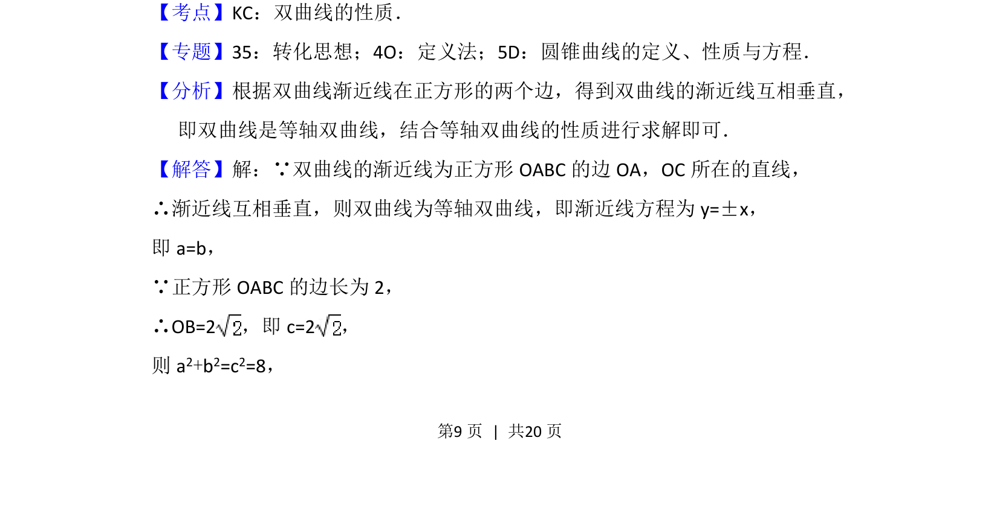
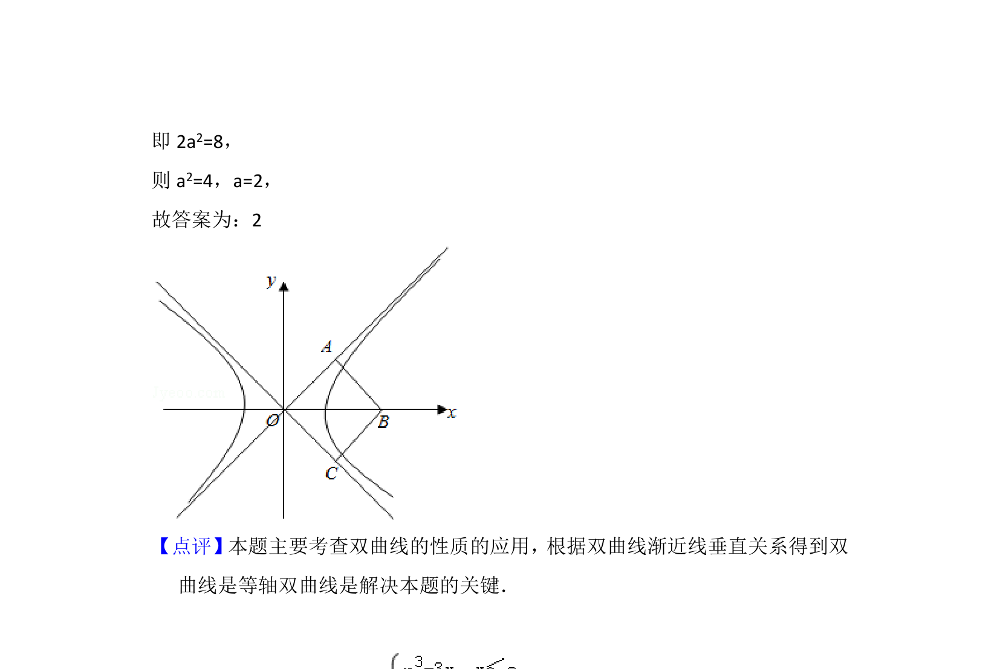

## 题面

## 摘要

双曲线渐近线与正方形结合，利用等轴双曲线性质求参数 a。

## 关联考点

- [[367-双曲线几何性质|双曲线性质]]
- [[1072-等轴双曲线|等轴双曲线]]
- [[渐近线垂直]]

## 答案与解析

> 📄 原 PDF 第 9 页：`素材/真题/北京/2008-2024·（北京）数学高考真题/2016年高考数学试卷（理）（北京）（解析卷）.pdf`
