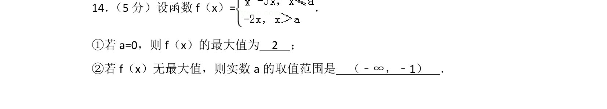
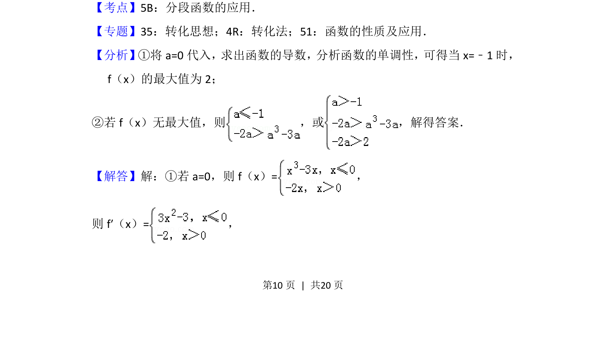
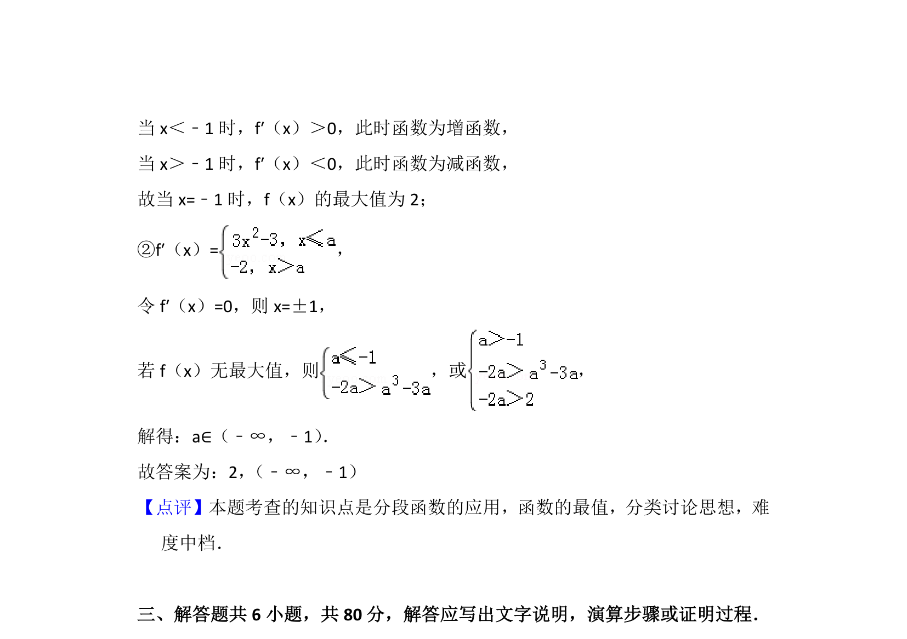

## 题面

## 摘要

求分段函数最值及无最大值时参数范围，涉及导数与单调性分析。

## 关联考点

- [[290-分段函数|分段函数]]
- [[1293-导数的应用|导数应用]]
- [[721-参数取值范围|参数取值范围]]
- [[719-单调性|单调性]]

## 答案与解析

> 📄 原 PDF 第 10 页：`素材/真题/北京/2008-2024·（北京）数学高考真题/2016年高考数学试卷（理）（北京）（解析卷）.pdf`
