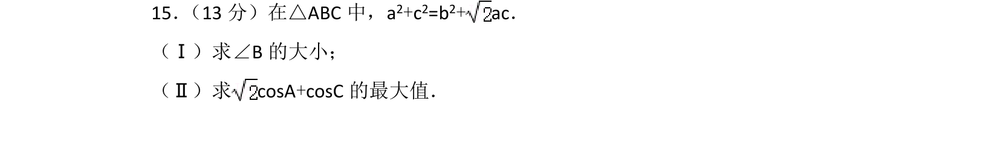
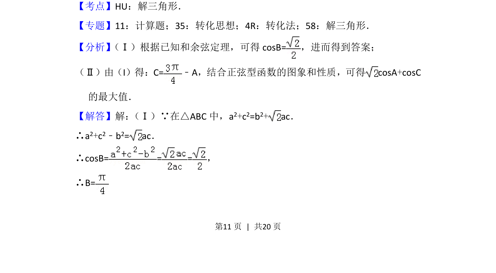
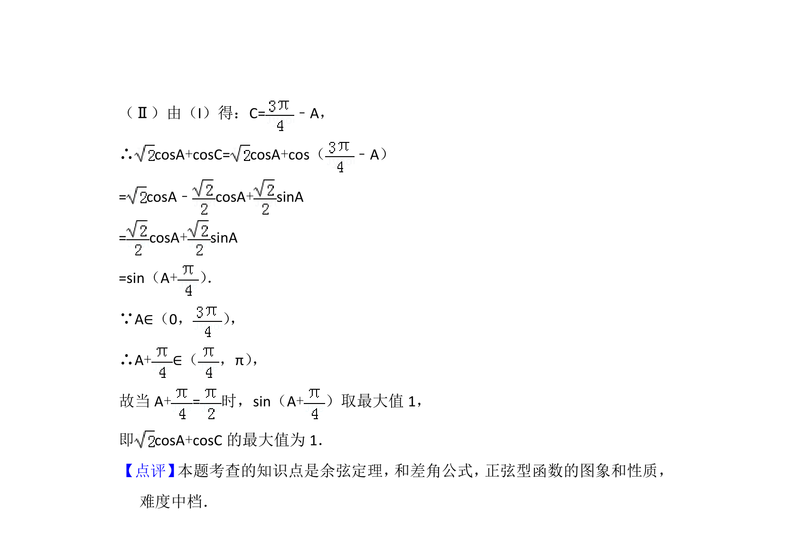

## 题面

## 摘要

在三角形中由边的关系求角，并求两角余弦和的最大值，涉及余弦定理与正弦型函数最值。

## 关联考点

- [[126-定理|余弦定理]]
- [[589-解三角形|解三角形]]
- [[265-Asin(ωx+φ)函数|正弦型函数]]
- [[286-函数的最值|最值]]

## 答案与解析

> 📄 原 PDF 第 11 页：`素材/真题/北京/2008-2024·（北京）数学高考真题/2016年高考数学试卷（理）（北京）（解析卷）.pdf`
