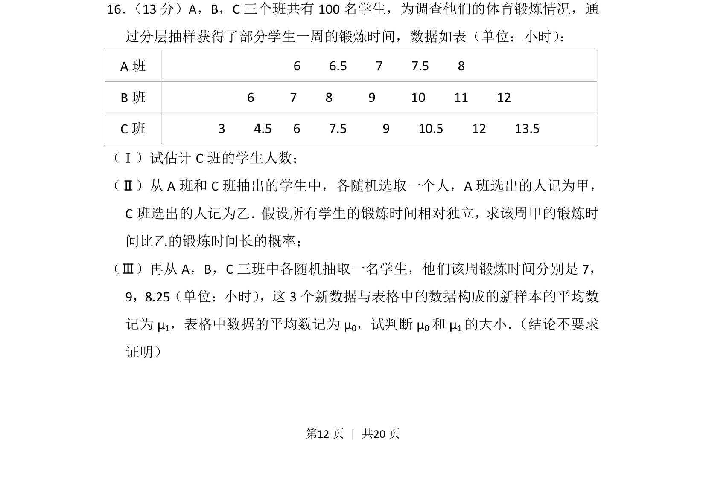
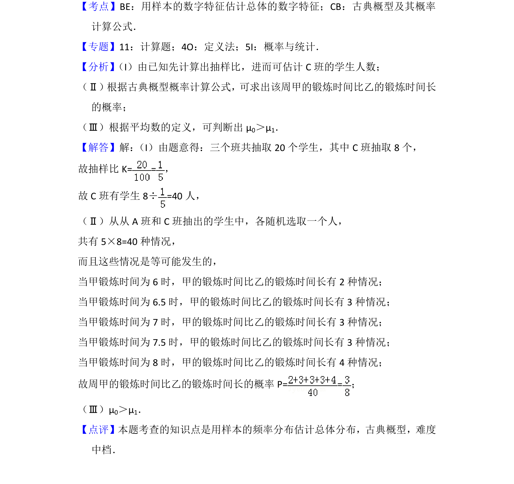

## 题面

## 摘要

分层抽样估计人数、独立事件概率计算、样本均值比较。

## 关联考点

- [[319-分层抽样|分层抽样]]
- [[320-古典概型|古典概型]]
- [[055-平均数|样本平均数]]
- [[468-事件相互独立性-高中|事件独立性]]

## 答案与解析

> 📄 原 PDF 第 12 页：`素材/真题/北京/2008-2024·（北京）数学高考真题/2016年高考数学试卷（理）（北京）（解析卷）.pdf`
