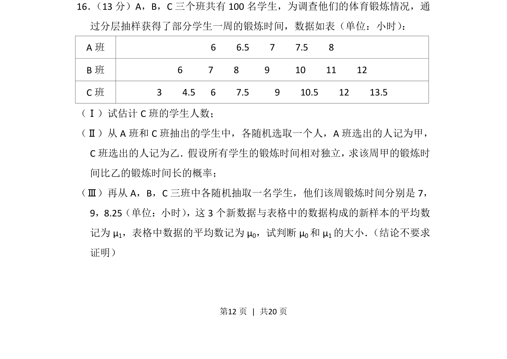
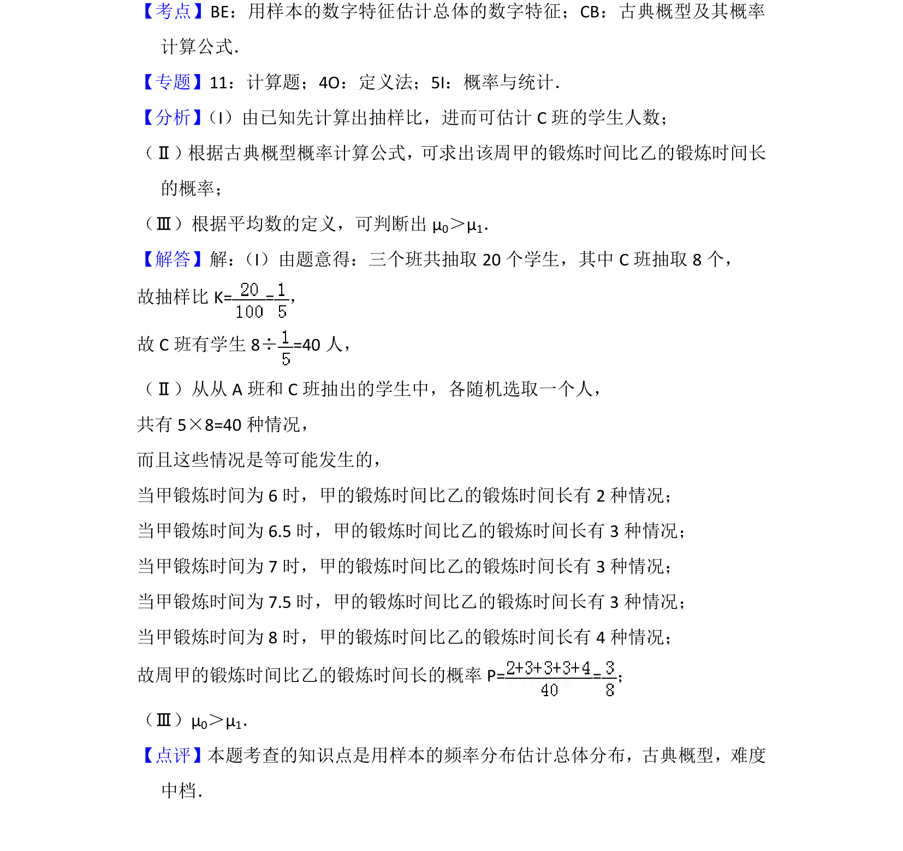

## 题面

## 摘要

分层抽样估计人数、独立事件概率计算、样本均值比较。

## 关联考点

- [[319-分层抽样|分层抽样]]
- [[320-古典概型|古典概型]]
- [[055-平均数|样本平均数]]
- [[468-事件相互独立性-高中|事件独立性]]

## 答案与解析

> 📄 原 PDF 第 12 页：`素材/真题/北京/2008-2024·（北京）数学高考真题/2016年高考数学试卷（理）（北京）（解析卷）.pdf`

<!-- 题干文本-start -->
## 题干文本
16． （13分）A，B，C三个班共有100名学生，为调查他们的体育锻炼情况，通
过分层抽样获得了部分学生一周的锻炼时间，数据如表（单位：小时） ：
A班 6    6.5    7    7.5    8
B班 6     7    8     9     10    11    12
C班 3    4.5   6    7.5     9    10.5    12    13.5
（Ⅰ）试估计C班的学生人数；
（Ⅱ）从A班和C班抽出的学生中，各随机选取一个人，A班选出的人记为甲，
C班选出的人记为乙．假设所有学生的锻炼时间相对独立， 求该周甲的锻炼时
间比乙的锻炼时间长的概率；
（Ⅲ）再从A，B，C三班中各随机抽取一名学生，他们该周锻炼时间分别是7，
9，8.25（单位：小时） ，这3个新数据与表格中的数据构成的新样本的平均数
记为μ 1，表格中数据的平均数记为μ 0，试判断μ 0和μ 1的大小． （结论不要求
证明）
<!-- 题干文本-end -->

<!-- 解析文本-start -->
## 解析文本

<!-- 解析文本-end -->
