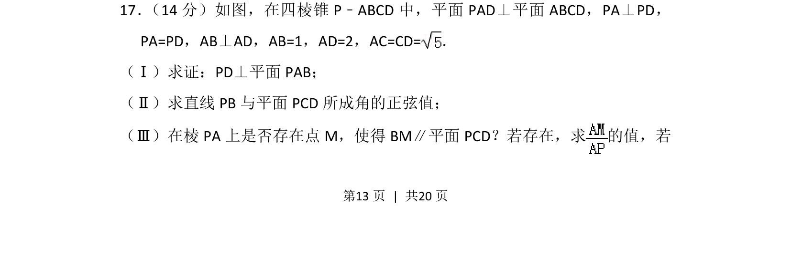
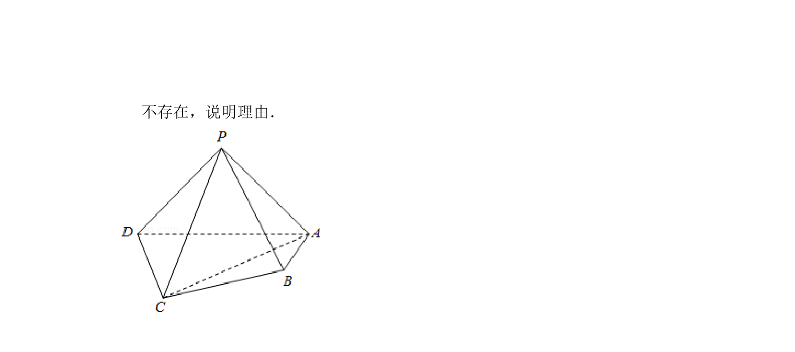
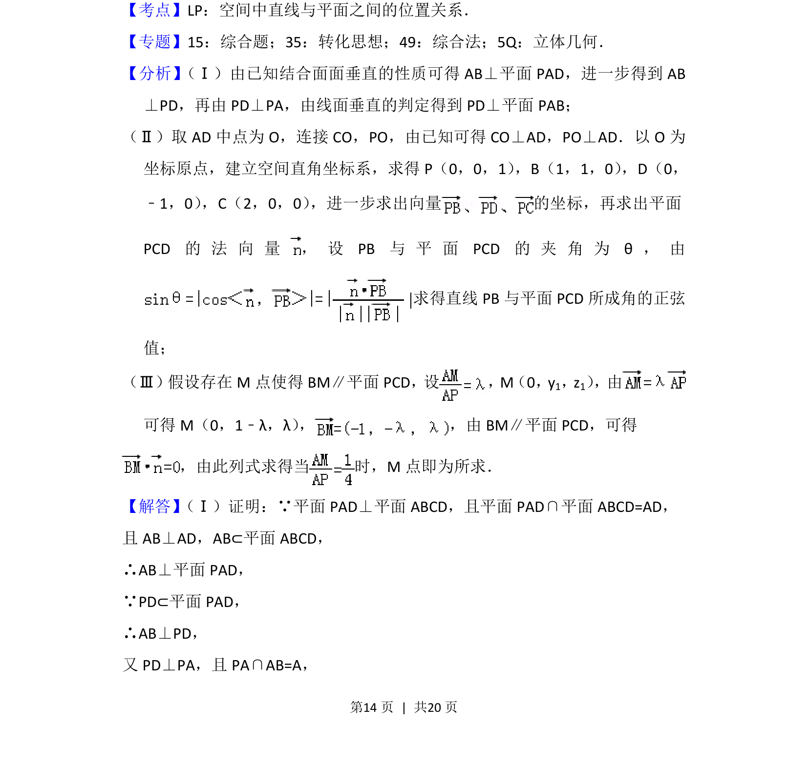
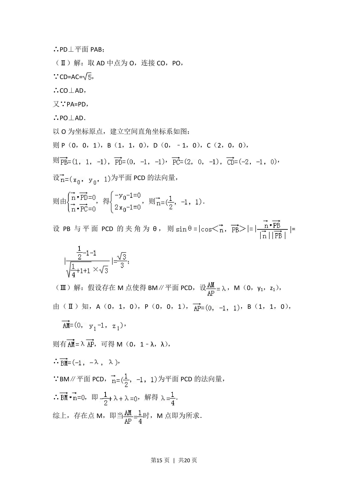
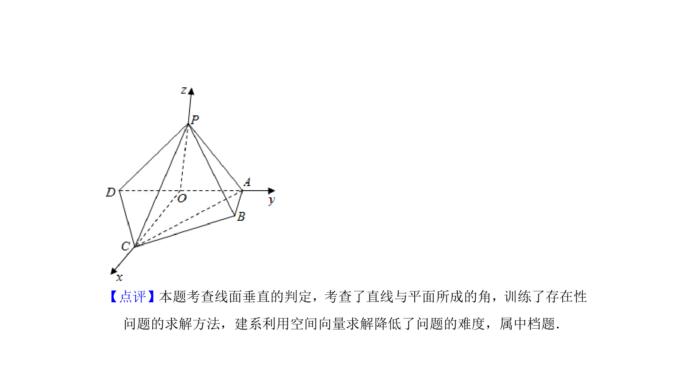

## 题面

## 摘要

四棱锥中证明线面垂直并求解线面角与探索动点存在性问题，考查空间位置关系与向量计算。

## 关联考点

- [[1085-线面垂直的判定|线面垂直判定]]
- [[353-空间角|线面角]]
- [[755-向量法求空间角|向量法求空间角]]
- [[立体几何存在性问题]]

## 答案与解析

> 📄 原 PDF 第 13 页：`素材/真题/北京/2008-2024·（北京）数学高考真题/2016年高考数学试卷（理）（北京）（解析卷）.pdf`

<!-- 题干文本-start -->
## 题干文本
17． （14分）如图，在四棱锥P﹣ABCD中，平面PAD⊥平面ABCD，PA⊥PD，
PA=PD，AB⊥AD，AB=1，AD=2，AC=CD=．
（Ⅰ）求证：PD⊥平面PAB；
（Ⅱ）求直线PB与平面PCD所成角的正弦值；
（Ⅲ）在棱PA上是否存在点M，使得BM∥平面PCD？若存在，求 的值，若
<!-- 题干文本-end -->

<!-- 解析文本-start -->
## 解析文本

<!-- 解析文本-end -->
