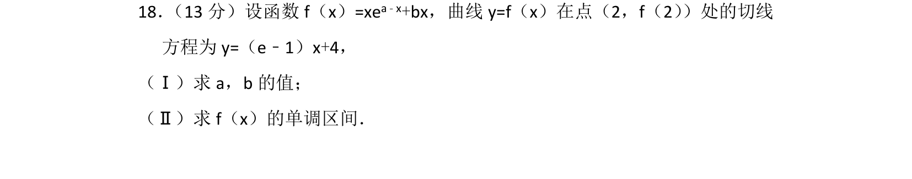
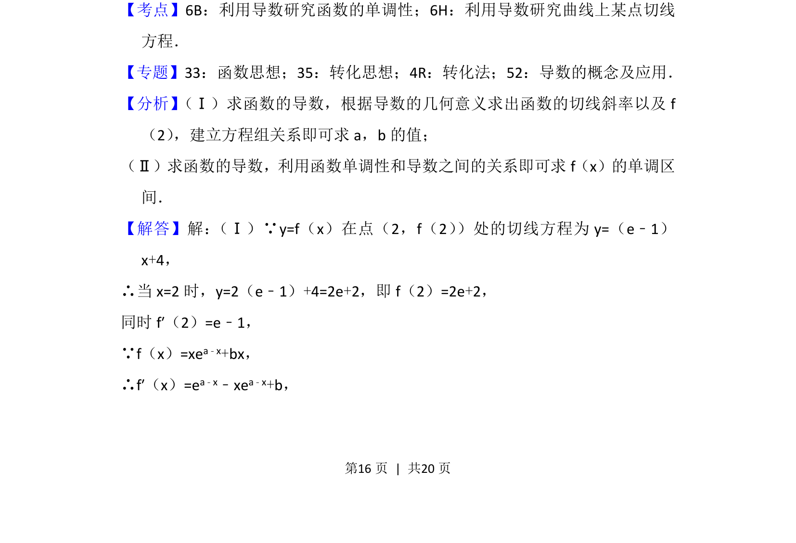
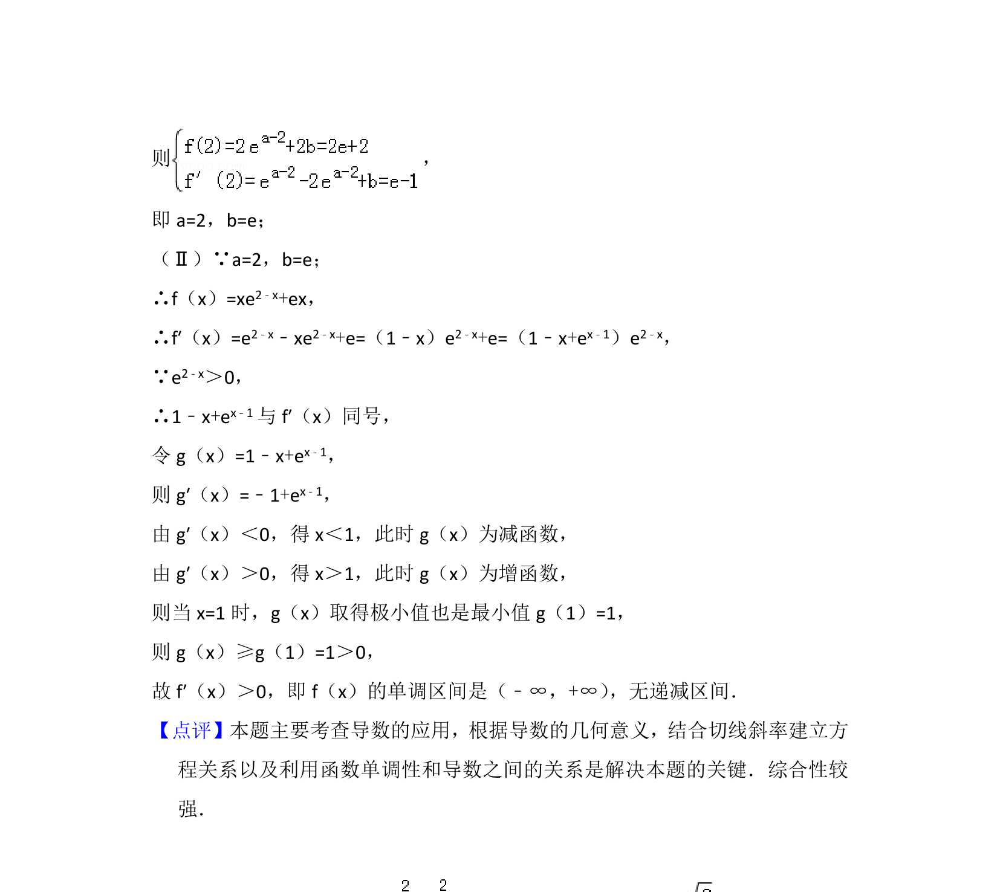

## 题面

## 摘要

求切线参数和利用导数确定函数单调区间的基础综合题。

## 关联考点

- [[705-利用导数研究函数的单调性|利用导数研究函数的单调性]]
- [[710-利用导数研究曲线上某点切线方程|利用导数研究曲线上某点切线方程]]

## 答案与解析

> 📄 原 PDF 第 16 页：`素材/真题/北京/2008-2024·（北京）数学高考真题/2016年高考数学试卷（理）（北京）（解析卷）.pdf`
