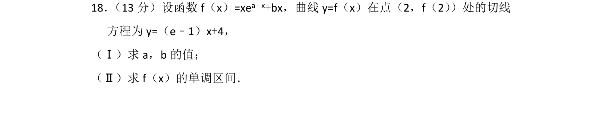
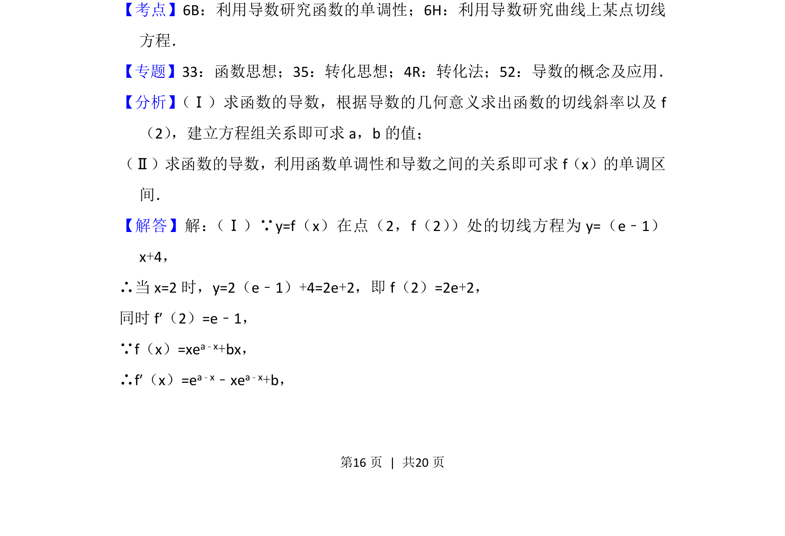
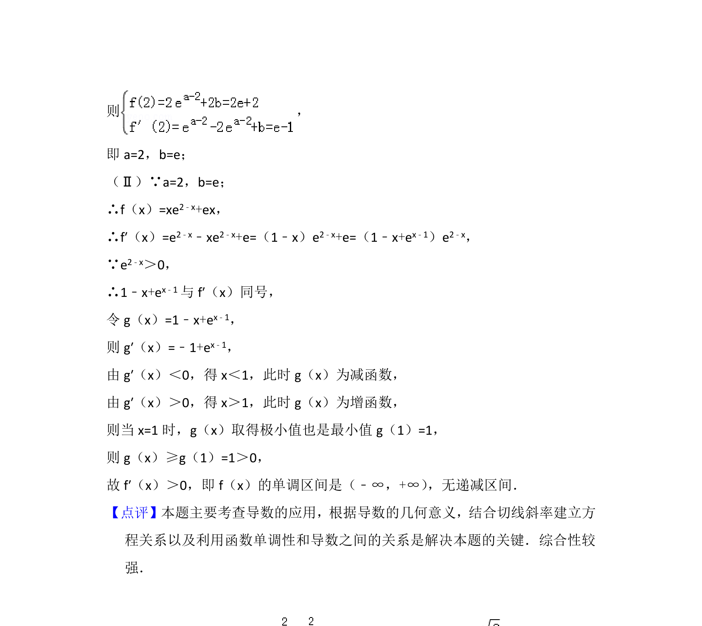

## 题面

## 摘要

求切线参数和利用导数确定函数单调区间的基础综合题。

## 关联考点

- [[705-利用导数研究函数的单调性|利用导数研究函数的单调性]]
- [[710-利用导数研究曲线上某点切线方程|利用导数研究曲线上某点切线方程]]

## 答案与解析

> 📄 原 PDF 第 16 页：`素材/真题/北京/2008-2024·（北京）数学高考真题/2016年高考数学试卷（理）（北京）（解析卷）.pdf`

<!-- 题干文本-start -->
## 题干文本
18． （13分）设函数f（x）=xea﹣x+bx，曲线y=f（x）在点（2，f（2） ）处的切线
方程为y=（e﹣1）x+4，
（Ⅰ）求a，b的值；
（Ⅱ）求f（x）的单调区间．
<!-- 题干文本-end -->

<!-- 解析文本-start -->
## 解析文本
【考点】6B：利用导数研究函数的单调性；6H：利用导数研究曲线上某点切线
方程．菁优网版权所有
【专题】33：函数思想；35：转化思想；4R：转化法；52：导数的概念及应用．
【分析】 （Ⅰ）求函数的导数，根据导数的几何意义求出函数的切线斜率以及f
（2） ，建立方程组关系即可求a，b的值；
（Ⅱ）求函数的导数，利用函数单调性和导数之间的关系即可求f（x）的单调区
间．
【解答】解： （Ⅰ）∵y=f（x）在点（2，f（2） ）处的切线方程为y=（e﹣1）
x+4，
∴当x=2时，y=2（e﹣1）+4=2e+2，即f（2）=2e+2，
同时f′（2）=e﹣1，
∵f（x）=xea﹣x+bx，
∴f′（x）=ea﹣x﹣xea﹣x+b，
<!-- 解析文本-end -->
