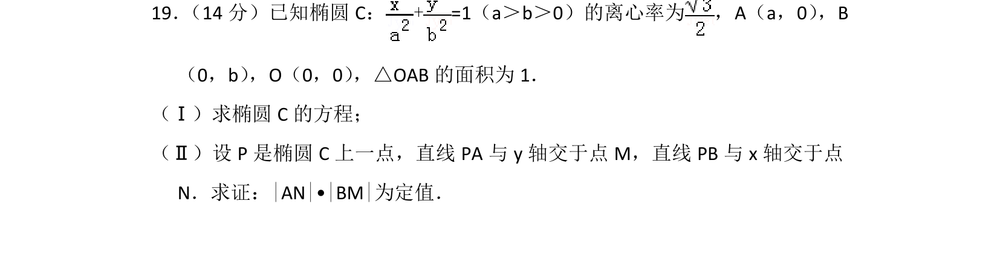
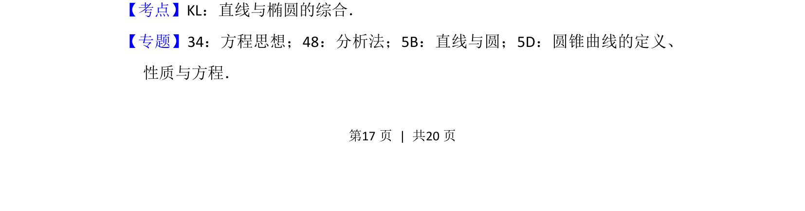
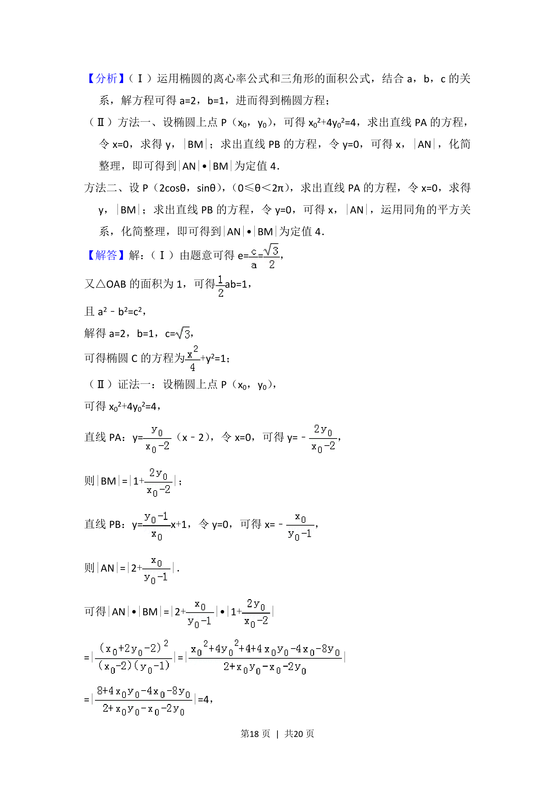
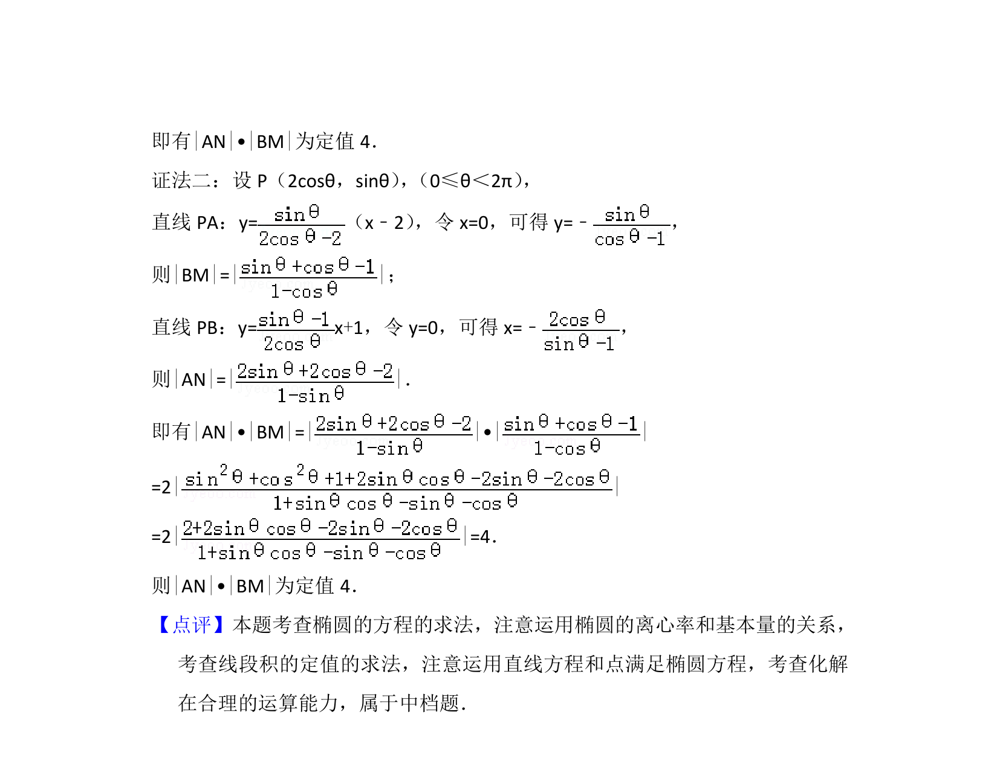

## 题面

## 摘要

求椭圆方程并证明两线段长度乘积为定值

## 关联考点

- [[942-椭圆标准方程|椭圆标准方程]]
- [[391-椭圆离心率|离心率]]
- [[575-直线与椭圆综合|直线与椭圆综合]]
- [[377-定点定值问题|定值问题]]

## 答案与解析

> 📄 原 PDF 第 17 页：`素材/真题/北京/2008-2024·（北京）数学高考真题/2016年高考数学试卷（理）（北京）（解析卷）.pdf`
