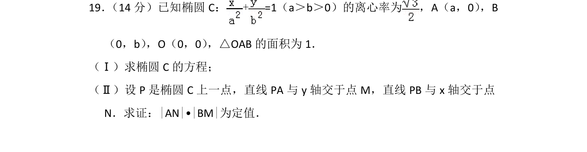
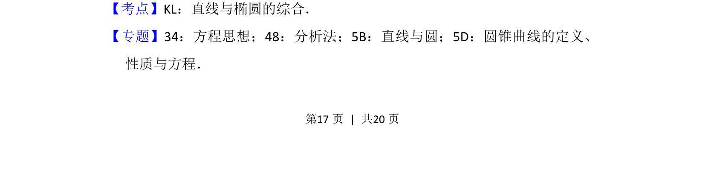
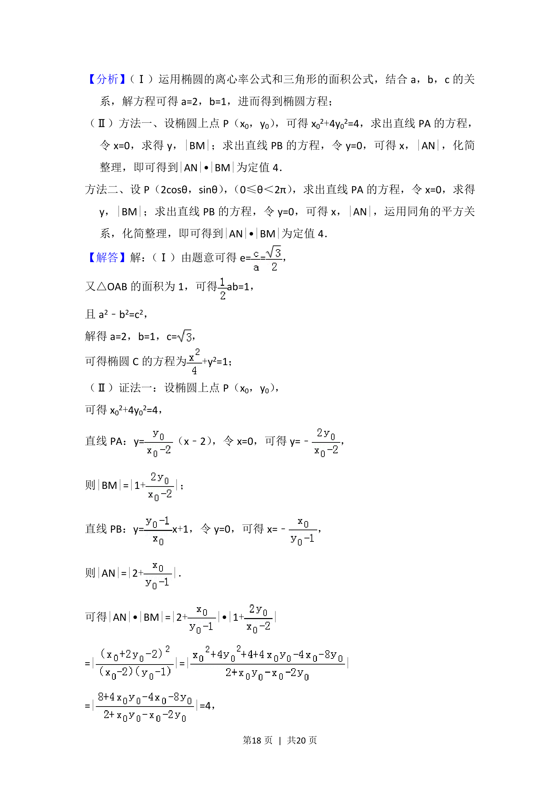
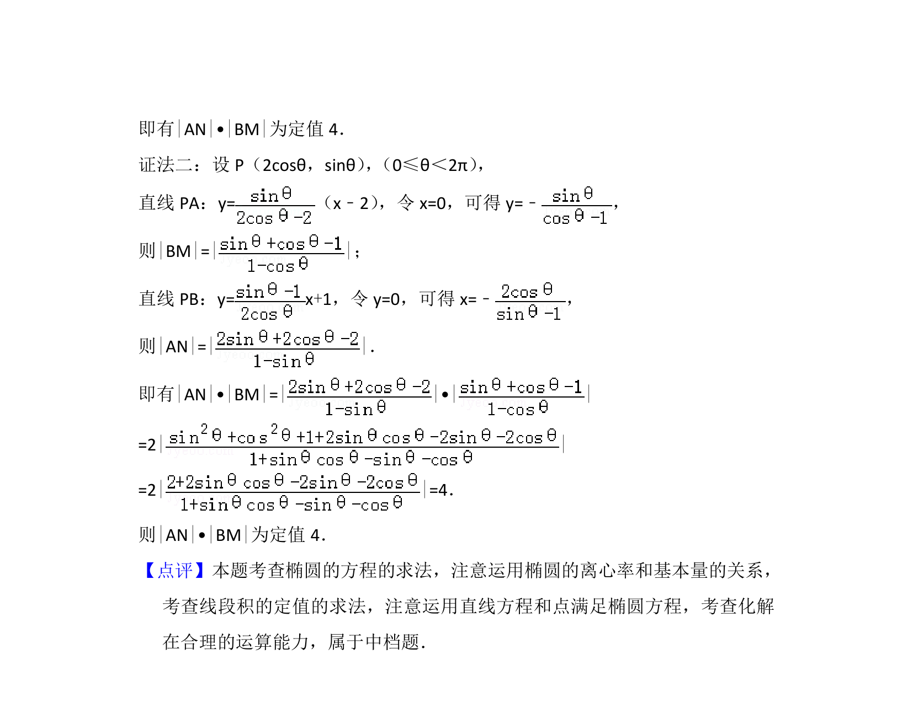

## 题面

## 摘要

求椭圆方程并证明两线段长度乘积为定值

## 关联考点

- [[941-椭圆标准方程|椭圆标准方程]]
- [[391-椭圆离心率|离心率]]
- [[575-直线与椭圆综合|直线与椭圆综合]]
- [[377-定点定值问题|定值问题]]

## 答案与解析

> 📄 原 PDF 第 17 页：`素材/真题/北京/2008-2024·（北京）数学高考真题/2016年高考数学试卷（理）（北京）（解析卷）.pdf`

<!-- 题干文本-start -->
## 题干文本
19． （14分）已知椭圆C：+=1（a＞b＞0）的离心率为 ，A（a，0） ，B
（0，b） ，O（0，0） ，△OAB的面积为1．
（Ⅰ）求椭圆C的方程；
（Ⅱ）设P是椭圆C上一点，直线PA与y轴交于点M，直线PB与x轴交于点
N．求证：|AN|•|BM|为定值．
<!-- 题干文本-end -->

<!-- 解析文本-start -->
## 解析文本
【考点】KL：直线与椭圆的综合．菁优网版权所有
【专题】34：方程思想；48：分析法；5B：直线与圆；5D：圆锥曲线的定义、
性质与方程．
<!-- 解析文本-end -->
