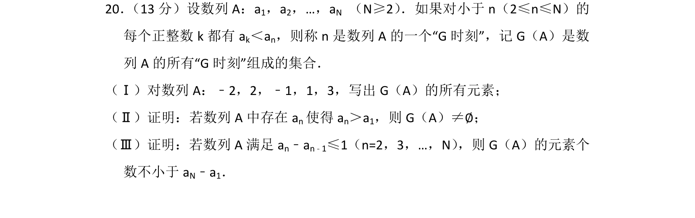
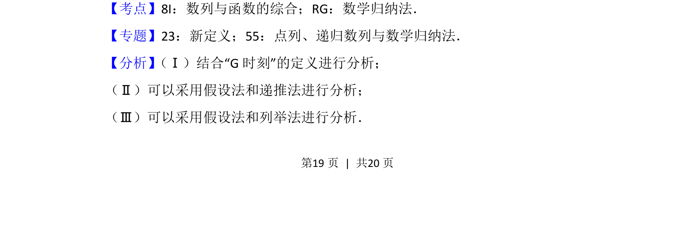
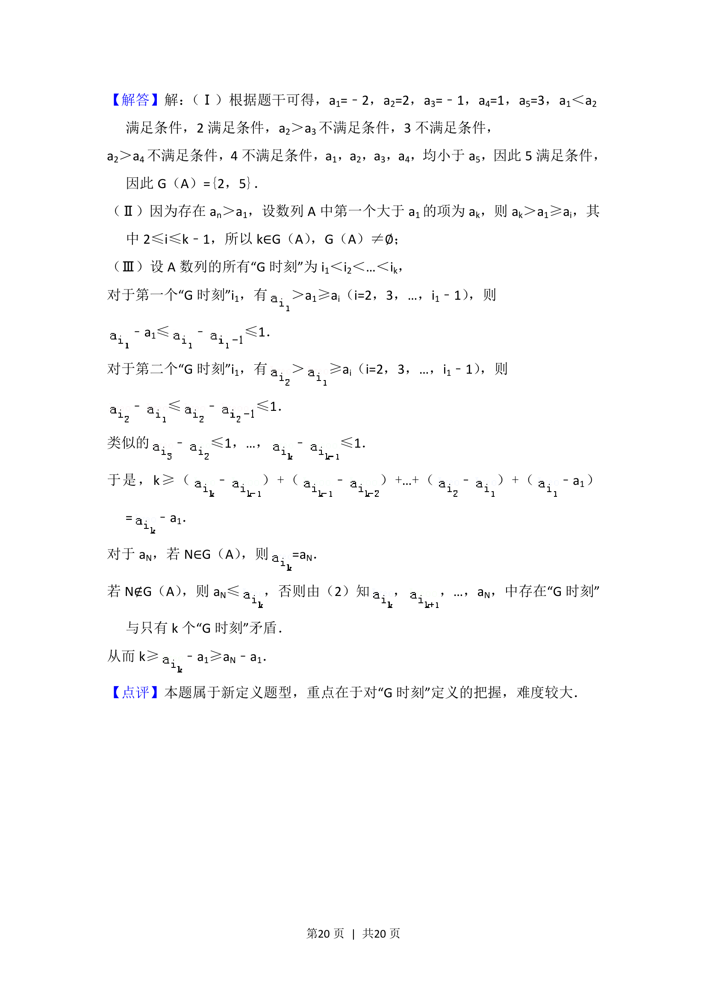

## 题面

## 摘要

本题考查数列新定义“G时刻”的理解与应用，通过分析数列项的大小关系进行存在性及数量下界的证明。

## 关联考点

- [[数列与函数的综合]]
- [[386-数学归纳法-初步|数学归纳法]]

## 答案与解析

> 📄 原 PDF 第 19 页：`素材/真题/北京/2008-2024·（北京）数学高考真题/2016年高考数学试卷（理）（北京）（解析卷）.pdf`
