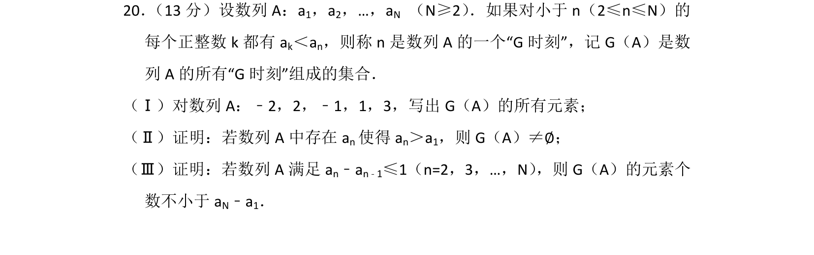
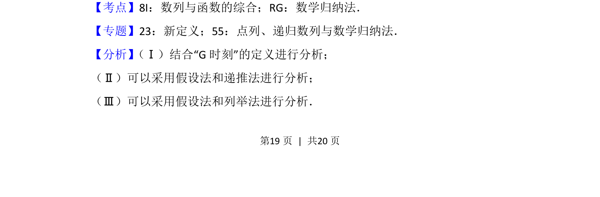
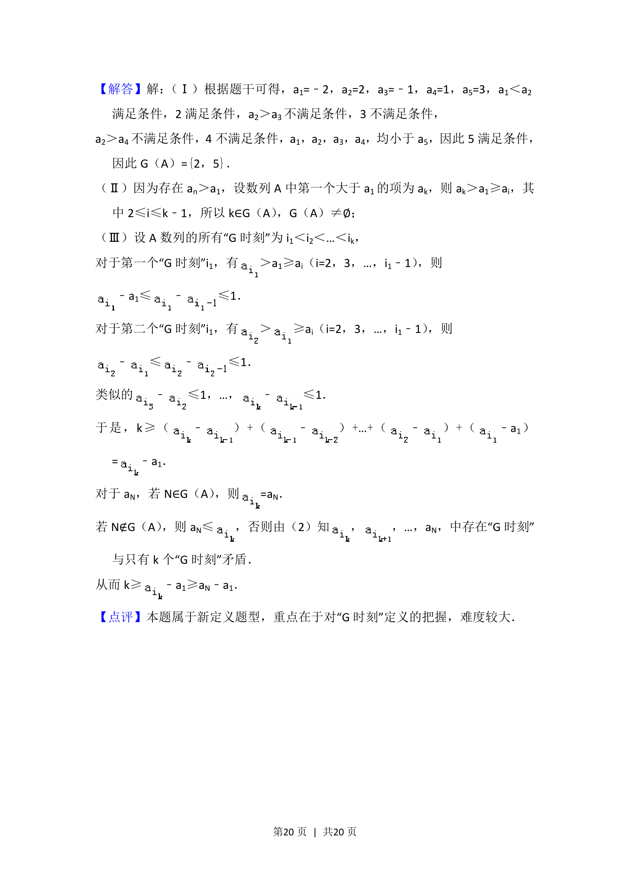

## 题面

## 摘要

本题考查数列新定义“G时刻”的理解与应用，通过分析数列项的大小关系进行存在性及数量下界的证明。

## 关联考点

- [[数列与函数的综合]]
- [[386-数学归纳法-初步|数学归纳法]]

## 答案与解析

> 📄 原 PDF 第 19 页：`素材/真题/北京/2008-2024·（北京）数学高考真题/2016年高考数学试卷（理）（北京）（解析卷）.pdf`

<!-- 题干文本-start -->
## 题干文本
20． （13分）设数列A：a1，a2，…，aN （N≥2） ．如果对小于n（2≤n≤N）的
每个正整数k都有a k＜an，则称n是数列A的一个“G时刻”，记G（A）是数
列A的所有“G时刻”组成的集合．
（Ⅰ）对数列A：﹣2，2，﹣1，1，3，写出G（A）的所有元素；
（Ⅱ）证明：若数列A中存在a n使得a n＞a1，则G（A）≠∅；
（Ⅲ）证明：若数列A满足a n﹣an﹣1≤1（n=2，3，…，N） ，则G（A）的元素个
数不小于a N﹣a1．
<!-- 题干文本-end -->

<!-- 解析文本-start -->
## 解析文本
【考点】8I：数列与函数的综合；RG：数学归纳法．菁优网版权所有
【专题】23：新定义；55：点列、递归数列与数学归纳法．
【分析】 （Ⅰ）结合“G时刻”的定义进行分析；
（Ⅱ）可以采用假设法和递推法进行分析；
（Ⅲ）可以采用假设法和列举法进行分析．
<!-- 解析文本-end -->
