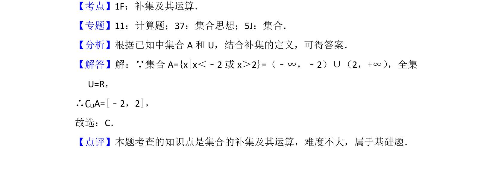

## 题面

## 摘要

集合补集运算，已知全集和集合求补集。

## 关联考点

- [[1101-补集|补集]]
- [[042-集合|集合]]

## 答案与解析

> 📄 原 PDF 第 1 页：`素材/真题/北京/2008-2024·（北京）数学高考真题/2017年高考数学试卷（文）（北京）（解析卷）.pdf`

<!-- 题干文本-start -->
## 题干文本
1． （5分）已知全集U=R，集合A={x|x＜﹣2或x＞2}，则∁ UA=（　　）
A． （﹣2，2）B． （﹣∞，﹣2）∪（2，+∞）
C．[﹣2，2]D． （﹣∞，﹣2]∪[2，+∞）
<!-- 题干文本-end -->

<!-- 解析文本-start -->
## 解析文本
【考点】1F：补集及其运算．菁优网版权所有
【专题】11：计算题；37：集合思想；5J：集合．
【分析】根据已知中集合A和U，结合补集的定义，可得答案．
【解答】解：∵集合A={x|x＜﹣2或x＞2}=（﹣∞，﹣2）∪（2，+∞） ，全集
U=R，
∴∁UA=[﹣2，2]，
故选：C．
【点评】本题考查的知识点是集合的补集及其运算，难度不大，属于基础题．
<!-- 解析文本-end -->
