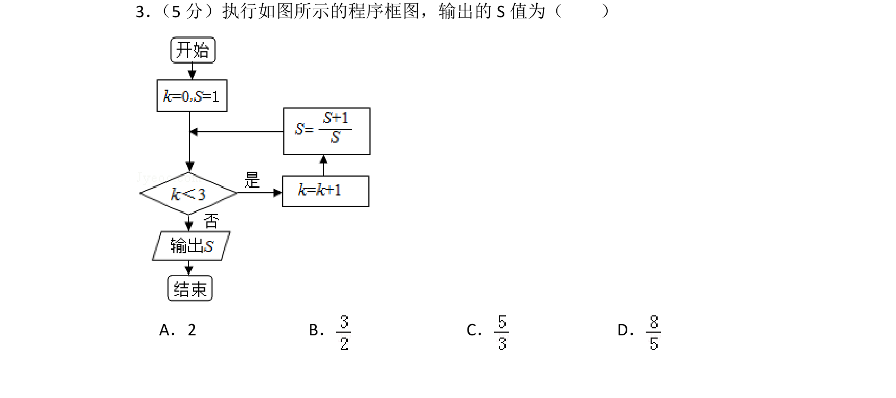
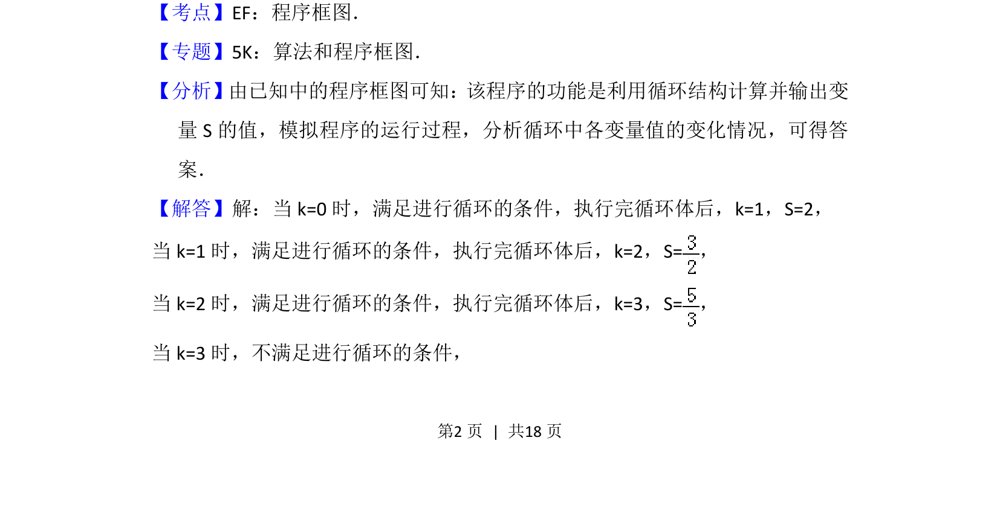
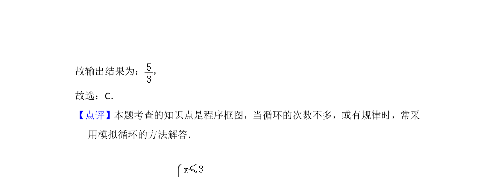

## 题面

## 摘要

考查程序框图中的循环结构，通过模拟运行计算输出变量S的值

## 关联考点

- [[1042-程序框图|程序框图]]
- [[870-循环结构|循环结构]]

## 答案与解析

> 📄 原 PDF 第 2 页：`素材/真题/北京/2008-2024·（北京）数学高考真题/2017年高考数学试卷（文）（北京）（解析卷）.pdf`

<!-- 题干文本-start -->
## 题干文本
3． （5分）执行如图所示的程序框图，输出的S值为（　　）
A．2 B．C．D．
<!-- 题干文本-end -->

<!-- 解析文本-start -->
## 解析文本
【考点】EF：程序框图．菁优网版权所有
【专题】5K：算法和程序框图．
【分析】由已知中的程序框图可知：该程序的功能是利用循环结构计算并输出变
量S的值，模拟程序的运行过程，分析循环中各变量值的变化情况，可得答
案．
【解答】解：当k=0时，满足进行循环的条件，执行完循环体后，k=1，S=2，
当k=1时，满足进行循环的条件，执行完循环体后，k=2，S=，
当k=2时，满足进行循环的条件，执行完循环体后，k=3，S=，
当k=3时，不满足进行循环的条件，
<!-- 解析文本-end -->
