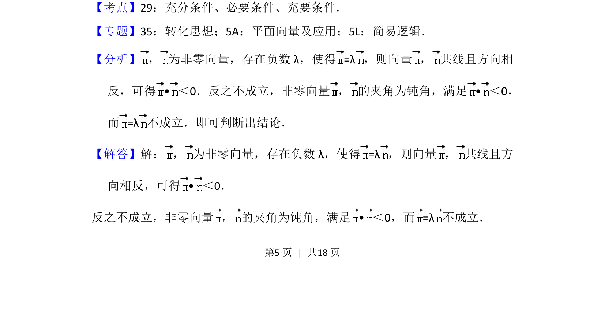
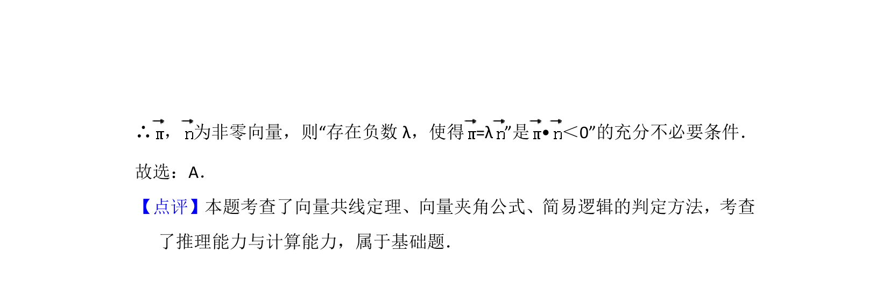

## 题面

## 摘要

存在负数λ使得两非零向量共线反向能推出数量积为负，反之不一定，考查充分必要条件。

## 关联考点

- [[533-充分必要条件|充分必要条件]]
- [[751-向量数量积|向量数量积]]
- [[743-向量共线|向量共线]]

## 答案与解析

> 📄 原 PDF 第 5 页：`素材/真题/北京/2008-2024·（北京）数学高考真题/2017年高考数学试卷（文）（北京）（解析卷）.pdf`
