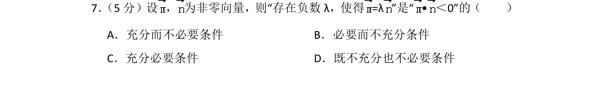
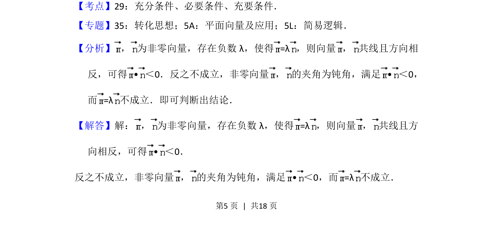
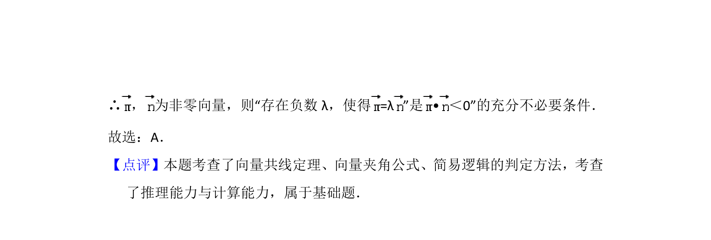

## 题面

## 摘要

存在负数λ使得两非零向量共线反向能推出数量积为负，反之不一定，考查充分必要条件。

## 关联考点

- [[533-充分必要条件|充分必要条件]]
- [[328-向量的数量积|向量数量积]]
- [[743-向量共线|向量共线]]

## 答案与解析

> 📄 原 PDF 第 5 页：`素材/真题/北京/2008-2024·（北京）数学高考真题/2017年高考数学试卷（文）（北京）（解析卷）.pdf`

<!-- 题干文本-start -->
## 题干文本
7． （5分）设 ， 为非零向量，则“存在负数λ，使得=λ”是“ •＜0”的（　　）
A．充分而不必要条件B．必要而不充分条件
C．充分必要条件D．既不充分也不必要条件
<!-- 题干文本-end -->

<!-- 解析文本-start -->
## 解析文本
【考点】29：充分条件、必要条件、充要条件．菁优网版权所有
【专题】35：转化思想；5A：平面向量及应用；5L：简易逻辑．
【分析】 ， 为非零向量，存在负数λ，使得=λ，则向量 ， 共线且方向相
反，可得•＜0．反之不成立，非零向量 ， 的夹角为钝角，满足•＜0，
而=λ不成立．即可判断出结论．
【解答】解： ， 为非零向量，存在负数λ，使得=λ，则向量 ， 共线且方
向相反，可得•＜0．
反之不成立，非零向量 ， 的夹角为钝角，满足•＜0，而=λ不成立．
<!-- 解析文本-end -->
