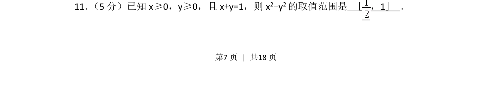
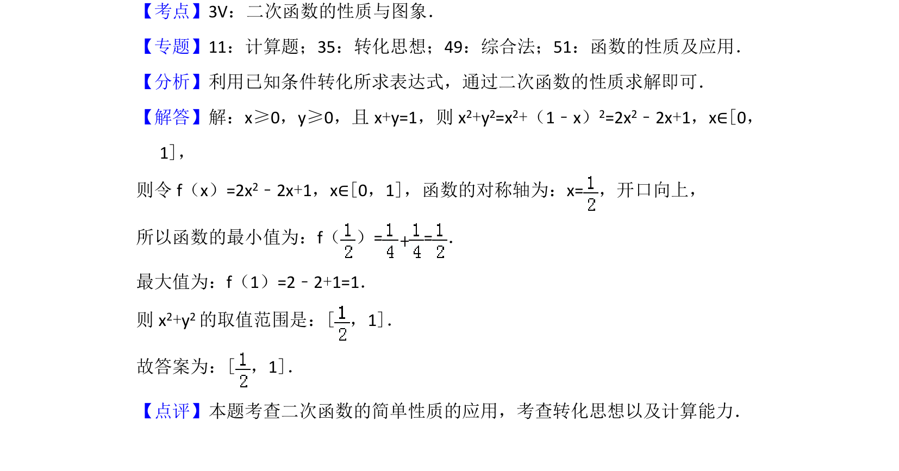

## 题面

## 摘要

已知非负实数满足线性等式，求二次式的取值范围，考查二次函数或不等式求最值。

## 关联考点

- [[640-二次函数最值|二次函数最值]]
- [[138-用不等式解决问题|不等式应用]]
- [[线性约束条件]]

## 答案与解析

> 📄 原 PDF 第 7 页：`素材/真题/北京/2008-2024·（北京）数学高考真题/2017年高考数学试卷（文）（北京）（解析卷）.pdf`
