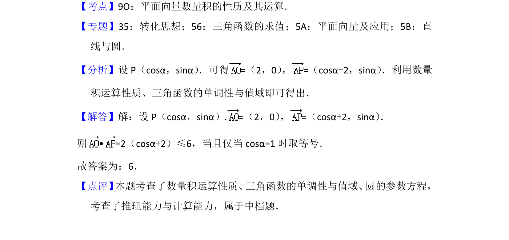

## 题面

## 摘要

考查圆的参数方程与向量数量积运算，利用三角函数有界性求最大值。

## 关联考点

- [[854-平面向量数量积|平面向量数量积]]
- [[544-圆的参数方程|圆的参数方程]]
- [[607-三角函数最值|三角函数最值]]

## 答案与解析

> 📄 原 PDF 第 8 页：`素材/真题/北京/2008-2024·（北京）数学高考真题/2017年高考数学试卷（文）（北京）（解析卷）.pdf`
