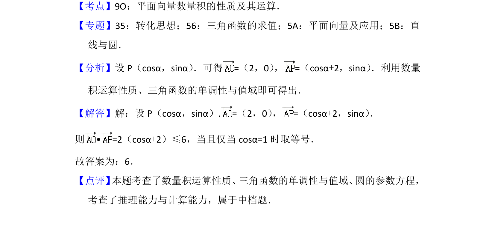

## 题面

## 摘要

考查圆的参数方程与向量数量积运算，利用三角函数有界性求最大值。

## 关联考点

- [[854-平面向量数量积|平面向量数量积]]
- [[544-圆的参数方程|圆的参数方程]]
- [[615-三角函数的最值|三角函数最值]]

## 答案与解析

> 📄 原 PDF 第 8 页：`素材/真题/北京/2008-2024·（北京）数学高考真题/2017年高考数学试卷（文）（北京）（解析卷）.pdf`

<!-- 题干文本-start -->
## 题干文本
12． （5分）已知点P在圆x 2+y2=1上，点A的坐标为（﹣2，0） ，O为原点，则
•的最大值为　6　．
<!-- 题干文本-end -->

<!-- 解析文本-start -->
## 解析文本
【考点】9O：平面向量数量积的性质及其运算．菁优网版权所有
【专题】35：转化思想；56：三角函数的求值；5A：平面向量及应用；5B：直
线与圆．
【分析】设P（cosα，sinα） ．可得=（2，0） ，=（cosα+2，sinα） ．利用数量
积运算性质、三角函数的单调性与值域即可得出．
【解答】解：设P（cosα，sinα）. =（2，0） ，=（cosα+2，sinα） ．
则• =2（cosα+2）≤6，当且仅当cosα=1时取等号．
故答案为：6．
【点评】 本题考查了数量积运算性质、 三角函数的单调性与值域、 圆的参数方程，
考查了推理能力与计算能力，属于中档题．
<!-- 解析文本-end -->
