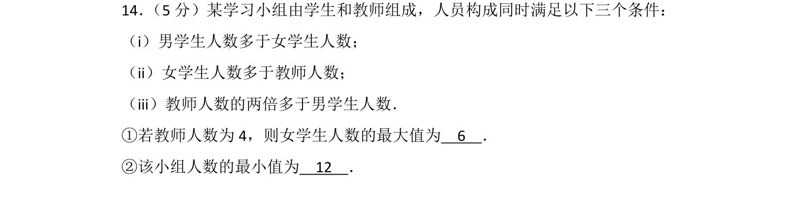
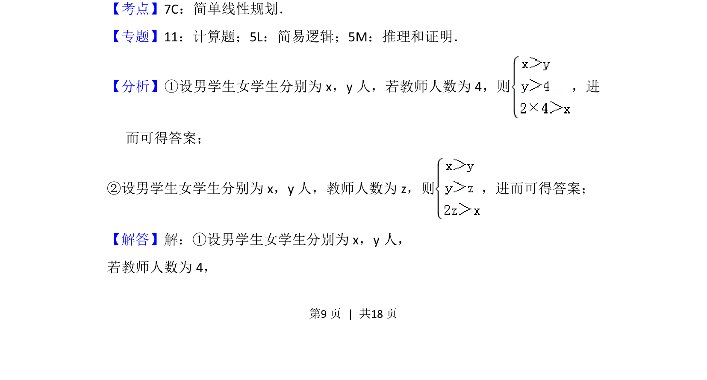
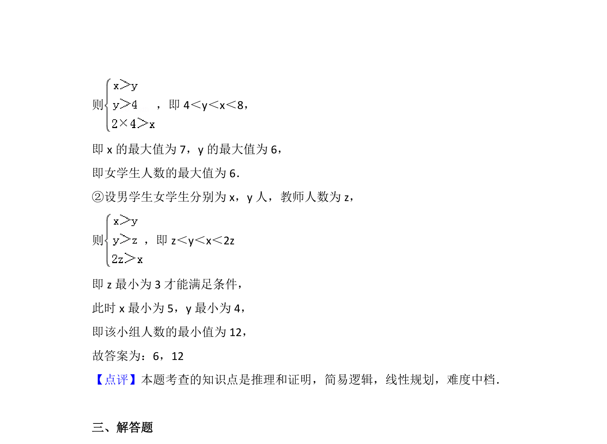

## 题面

## 摘要

该题通过三个人员数量不等式条件，考查逻辑推理与简单线性规划求最值。

## 关联考点

- [[1074-简单线性规划|简单线性规划]]
- [[083-不等式|不等式]]
- [[037-推理|逻辑推理]]

## 答案与解析

> 📄 原 PDF 第 9 页：`素材/真题/北京/2008-2024·（北京）数学高考真题/2017年高考数学试卷（文）（北京）（解析卷）.pdf`
