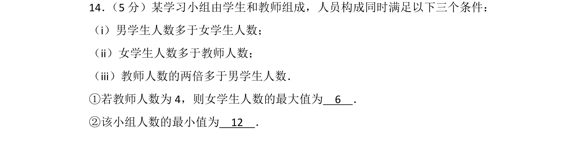
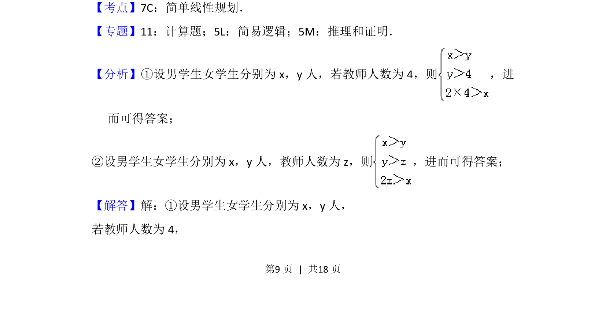
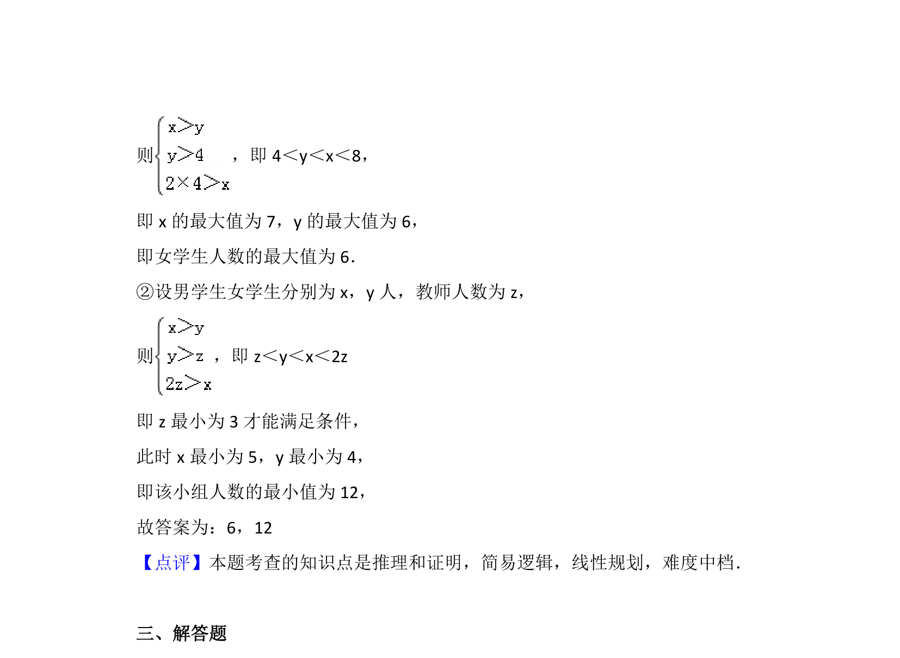

## 题面

## 摘要

该题通过三个人员数量不等式条件，考查逻辑推理与简单线性规划求最值。

## 关联考点

- [[1074-简单线性规划|简单线性规划]]
- [[083-不等式|不等式]]
- [[037-推理|逻辑推理]]

## 答案与解析

> 📄 原 PDF 第 9 页：`素材/真题/北京/2008-2024·（北京）数学高考真题/2017年高考数学试卷（文）（北京）（解析卷）.pdf`

<!-- 题干文本-start -->
## 题干文本
14． （5分）某学习小组由学生和教师组成，人员构成同时满足以下三个条件：
（i）男学生人数多于女学生人数；
（ii）女学生人数多于教师人数；
（iii）教师人数的两倍多于男学生人数．
①若教师人数为4，则女学生人数的最大值为　6　．
②该小组人数的最小值为　12　．
<!-- 题干文本-end -->

<!-- 解析文本-start -->
## 解析文本
【考点】7C：简单线性规划．菁优网版权所有
【专题】11：计算题；5L：简易逻辑；5M：推理和证明．
【分析】①设男学生女学生分别为x，y人，若教师人数为4，则 ，进
而可得答案；
②设男学生女学生分别为x，y人，教师人数为z，则 ，进而可得答案；
【解答】解：①设男学生女学生分别为x，y人，
若教师人数为4，
<!-- 解析文本-end -->
