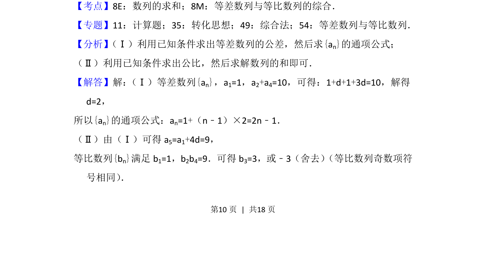
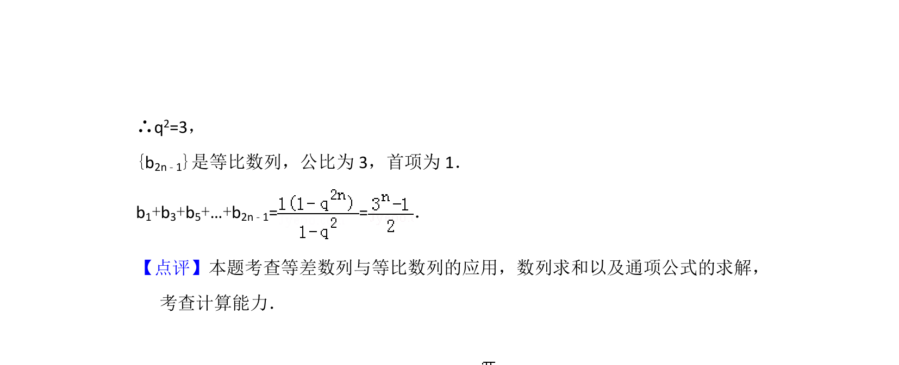

## 题面

## 摘要

已知等差数列和等比数列满足条件，求通项公式及奇数项求和。

## 关联考点

- [[1081-累加求和|数列求和]]
- [[等差数列与等比数列综合]]

## 答案与解析

> 📄 原 PDF 第 10 页：`素材/真题/北京/2008-2024·（北京）数学高考真题/2017年高考数学试卷（文）（北京）（解析卷）.pdf`

<!-- 题干文本-start -->
## 题干文本
15． （13分）已知等差数列{an}和等比数列{bn}满足a 1=b1=1，a2+a4=10，b2b4=a5．
（Ⅰ）求{an}的通项公式；
（Ⅱ）求和：b1+b3+b5+…+b2n﹣1．
<!-- 题干文本-end -->

<!-- 解析文本-start -->
## 解析文本
【考点】8E：数列的求和；8M：等差数列与等比数列的综合．菁优网版权所有
【专题】11：计算题；35：转化思想；49：综合法；54：等差数列与等比数列．
【分析】 （Ⅰ）利用已知条件求出等差数列的公差，然后求{an}的通项公式；
（Ⅱ）利用已知条件求出公比，然后求解数列的和即可．
【解答】解： （Ⅰ）等差数列{an}，a1=1，a2+a4=10，可得：1+d+1+3d=10，解得
d=2，
所以{an}的通项公式：an=1+（n﹣1）×2=2n﹣1．
（Ⅱ）由（Ⅰ）可得a 5=a1+4d=9，
等比数列{bn}满足b 1=1，b2b4=9．可得b 3=3，或﹣3（舍去） （等比数列奇数项符
号相同） ．
<!-- 解析文本-end -->
