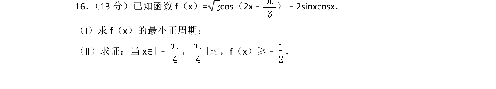
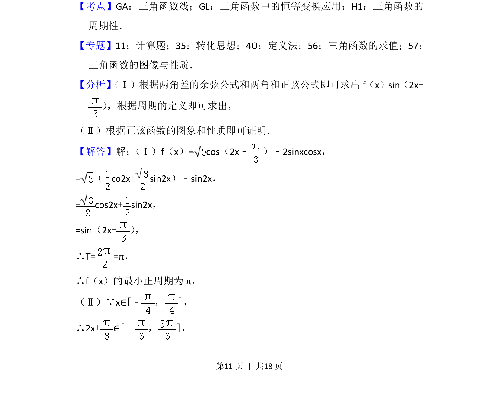
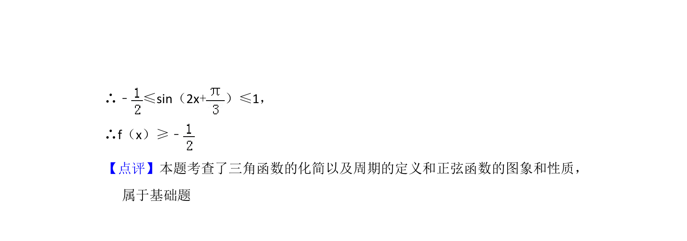

## 题面

## 摘要

考查三角恒等变换化简函数并求周期，利用正弦函数性质证明不等式。

## 关联考点

- [[1248-三角函数恒等变换|三角函数恒等变换]]
- [[611-三角函数的周期性|三角函数的周期性]]
- [[正弦函数的图象与性质]]

## 答案与解析

> 📄 原 PDF 第 11 页：`素材/真题/北京/2008-2024·（北京）数学高考真题/2017年高考数学试卷（文）（北京）（解析卷）.pdf`
