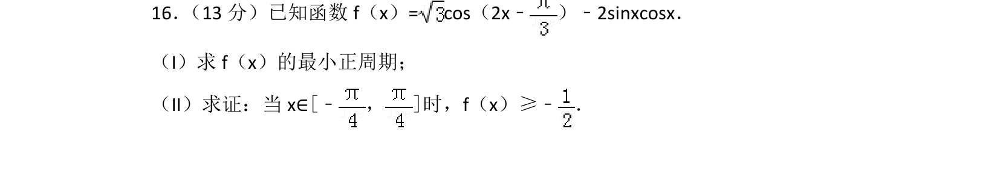
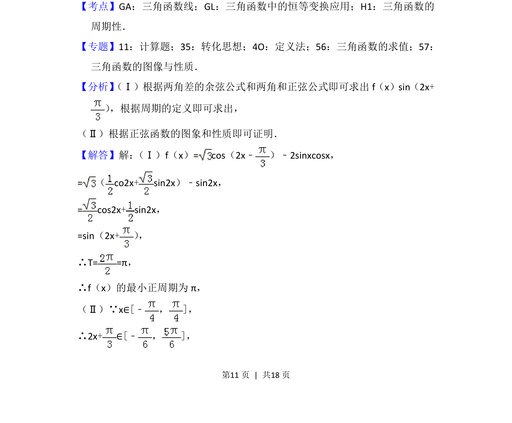
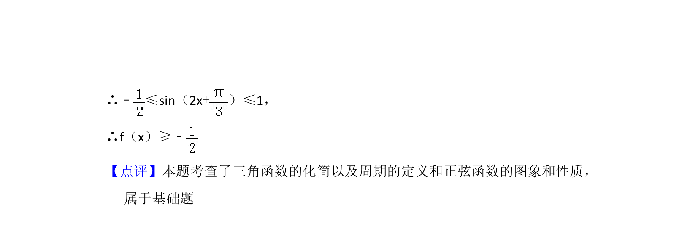

## 题面

## 摘要

考查三角恒等变换化简函数并求周期，利用正弦函数性质证明不等式。

## 关联考点

- [[1248-三角函数恒等变换|三角函数恒等变换]]
- [[611-三角函数的周期性|三角函数的周期性]]
- [[正弦函数的图象与性质]]

## 答案与解析

> 📄 原 PDF 第 11 页：`素材/真题/北京/2008-2024·（北京）数学高考真题/2017年高考数学试卷（文）（北京）（解析卷）.pdf`

<!-- 题干文本-start -->
## 题干文本
16． （13分）已知函数f（x）= cos（2x﹣）﹣2sinxcosx．
（I）求f（x）的最小正周期；
（II）求证：当x∈[﹣，]时，f（x）≥﹣．
<!-- 题干文本-end -->

<!-- 解析文本-start -->
## 解析文本
【考点】GA：三角函数线；GL：三角函数中的恒等变换应用；H1：三角函数的
周期性．菁优网版权所有
【专题】11：计算题；35：转化思想；4O：定义法；56：三角函数的求值；57：
三角函数的图像与性质．
【分析】 （Ⅰ）根据两角差的余弦公式和两角和正弦公式即可求出f（x）sin（2x+
） ，根据周期的定义即可求出，
（Ⅱ）根据正弦函数的图象和性质即可证明．
【解答】解： （Ⅰ）f（x）= cos（2x﹣）﹣2sinxcosx，
=（co2x+sin2x）﹣sin2x，
= cos2x+sin2x，
=sin（2x+） ，
∴T==π，
∴f（x）的最小正周期为π，
（Ⅱ）∵x∈[﹣，]，
∴2x+∈[﹣，]，
<!-- 解析文本-end -->
