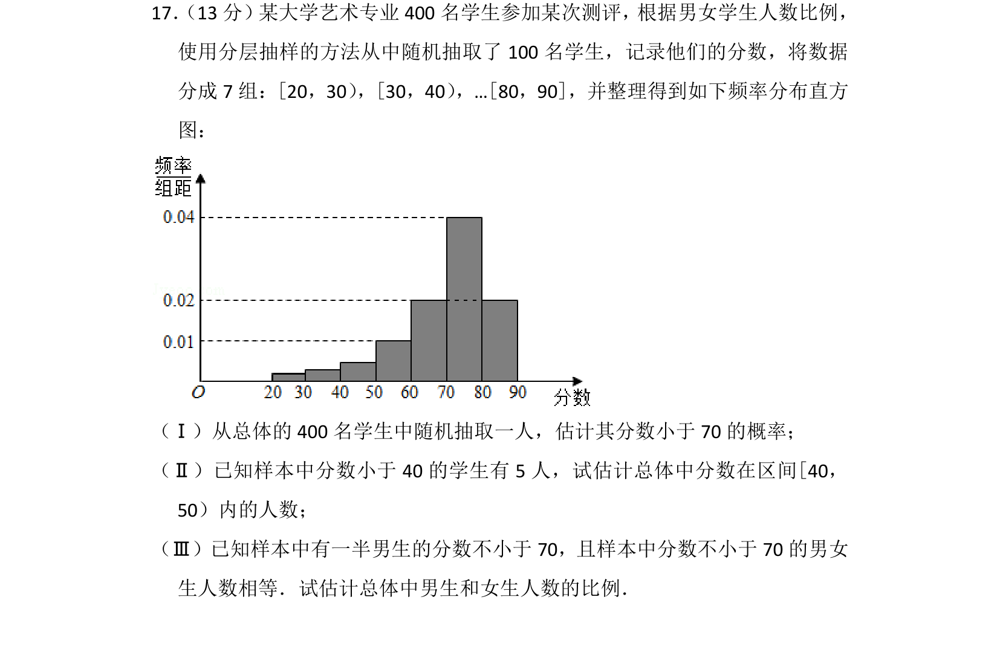
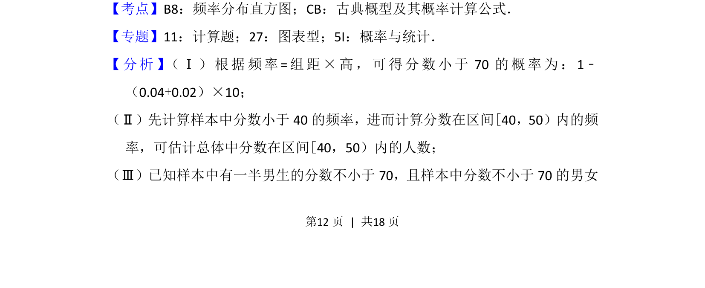
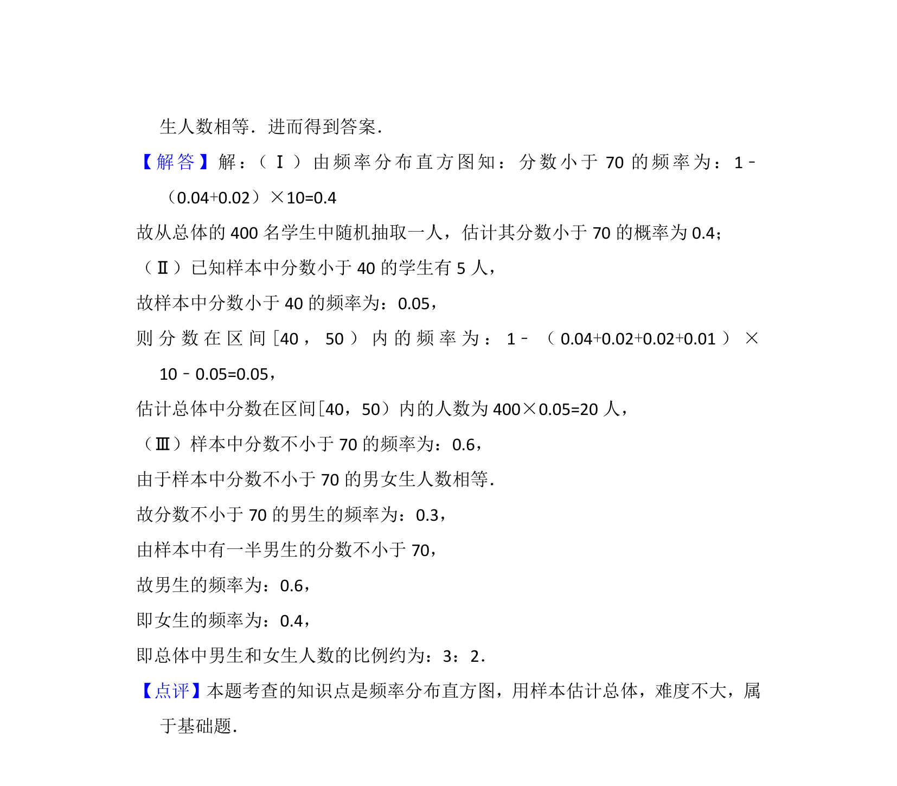

## 题面

## 摘要

本题利用频率分布直方图估计概率、计算区间人数，并结合分层抽样信息推断总体男女生比例。

## 关联考点

- [[364-频率分布直方图|频率分布直方图]]
- [[320-古典概型|古典概型]]
- [[319-分层抽样|分层抽样]]
- [[1401-总体估计|总体估计]]

## 答案与解析

> 📄 原 PDF 第 12 页：`素材/真题/北京/2008-2024·（北京）数学高考真题/2017年高考数学试卷（文）（北京）（解析卷）.pdf`
