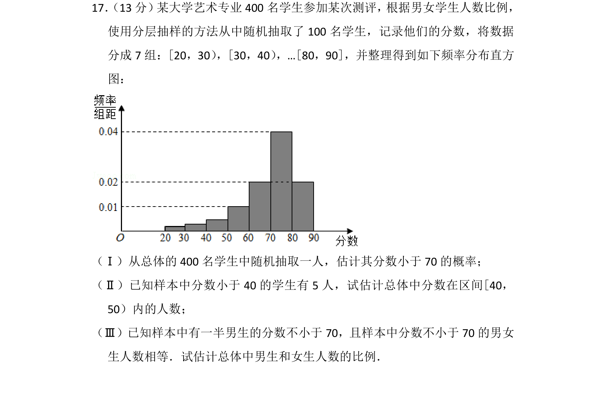
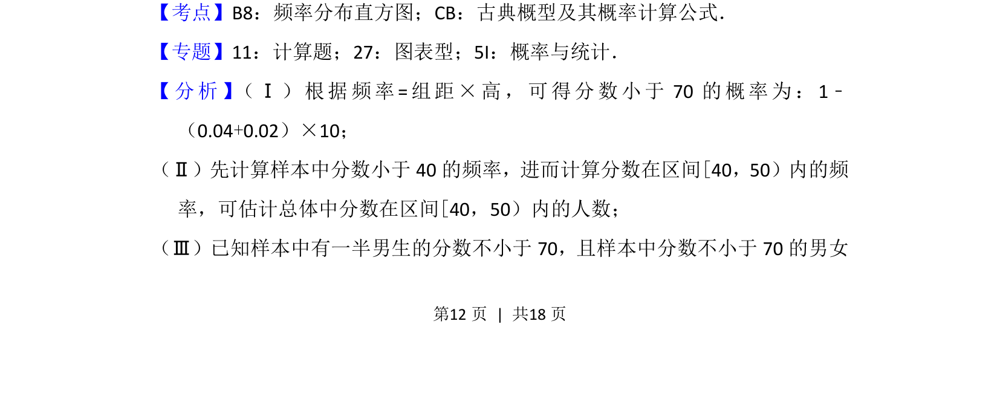
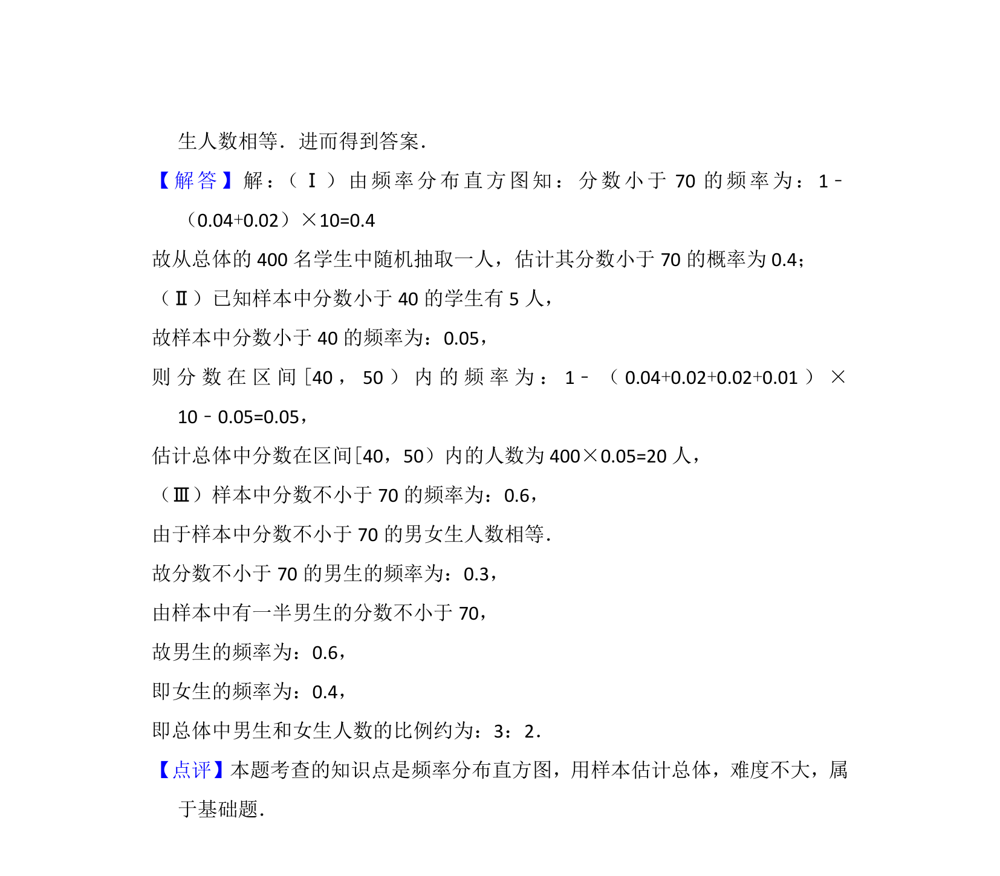

## 题面

## 摘要

本题利用频率分布直方图估计概率、计算区间人数，并结合分层抽样信息推断总体男女生比例。

## 关联考点

- [[364-频率分布直方图|频率分布直方图]]
- [[320-古典概型|古典概型]]
- [[319-分层抽样|分层抽样]]
- [[1401-总体估计|总体估计]]

## 答案与解析

> 📄 原 PDF 第 12 页：`素材/真题/北京/2008-2024·（北京）数学高考真题/2017年高考数学试卷（文）（北京）（解析卷）.pdf`

<!-- 题干文本-start -->
## 题干文本
17． （13分）某大学艺术专业400名学生参加某次测评，根据男女学生人数比例，
使用分层抽样的方法从中随机抽取了100名学生，记录他们的分数，将数据
分成7组：[20，30） ，[30，40） ，…[80，90]，并整理得到如下频率分布直方
图：
（Ⅰ）从总体的400名学生中随机抽取一人，估计其分数小于70的概率；
（Ⅱ）已知样本中分数小于40的学生有5人，试估计总体中分数在区间[40，
50）内的人数；
（Ⅲ）已知样本中有一半男生的分数不小于70，且样本中分数不小于70的男女
生人数相等．试估计总体中男生和女生人数的比例．
<!-- 题干文本-end -->

<!-- 解析文本-start -->
## 解析文本
【考点】B8：频率分布直方图；CB：古典概型及其概率计算公式．菁优网版权所有
【专题】11：计算题；27：图表型；5I：概率与统计．
【分析】 （Ⅰ）根据频率=组距×高，可得分数小于70的概率为：1﹣
（0.04+0.02）×10；
（Ⅱ）先计算样本中分数小于40的频率，进而计算分数在区间[40，50）内的频
率，可估计总体中分数在区间[40，50）内的人数；
（Ⅲ）已知样本中有一半男生的分数不小于70，且样本中分数不小于70的男女
<!-- 解析文本-end -->
