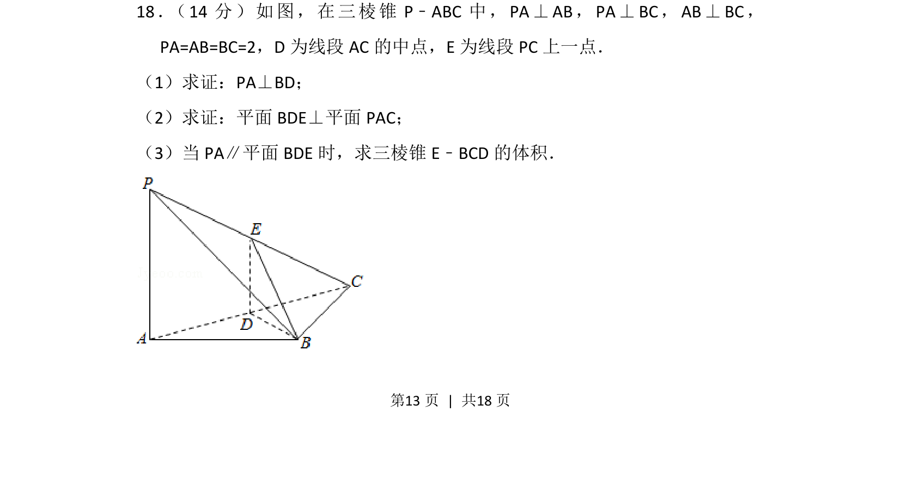
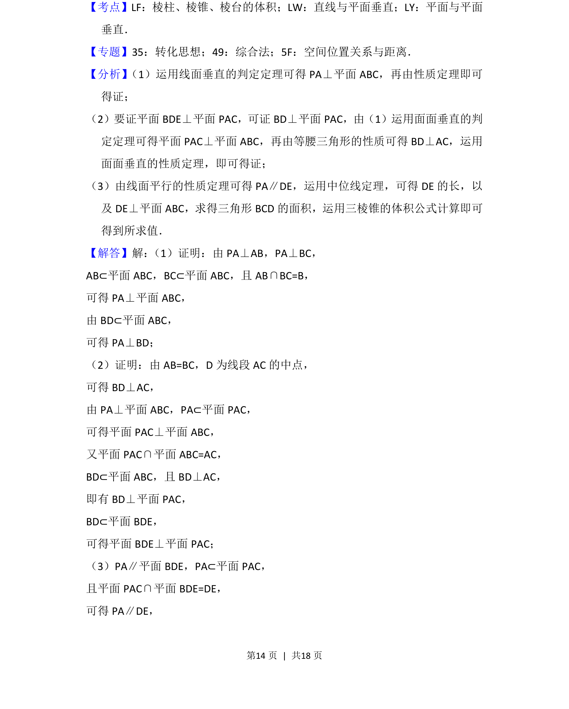
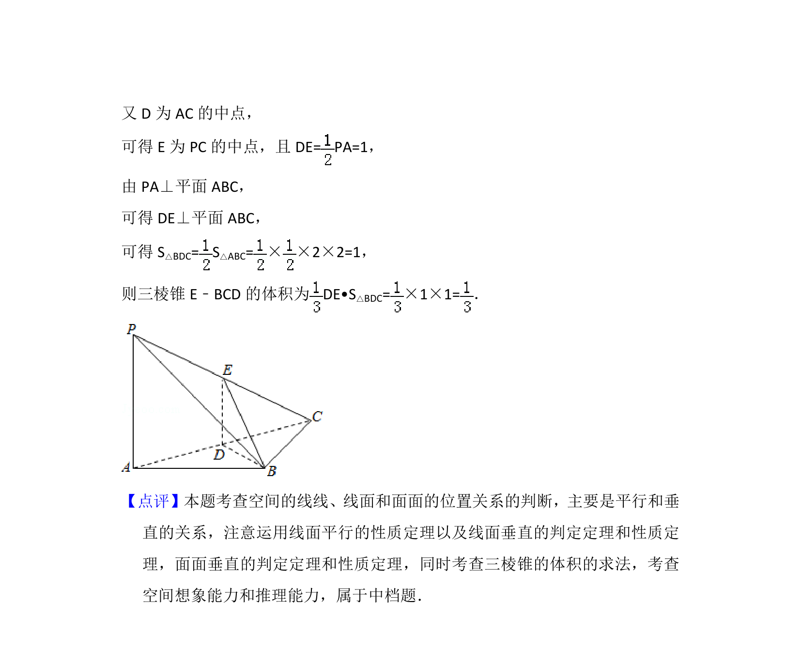

## 题面

## 摘要

该题考查空间垂直关系的证明、线面平行的性质应用以及三棱锥体积的求解。

## 关联考点

- [[1087-线面垂直的判定与性质|线面垂直的判定与性质]]
- [[1150-面面垂直的判定|面面垂直的判定]]
- [[线面平行的性质定理]]
- [[三棱锥的体积]]

## 答案与解析

> 📄 原 PDF 第 13 页：`素材/真题/北京/2008-2024·（北京）数学高考真题/2017年高考数学试卷（文）（北京）（解析卷）.pdf`
