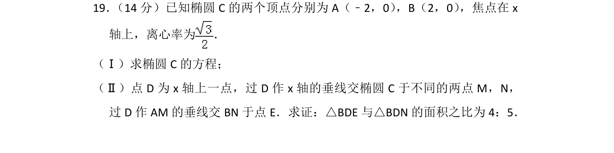
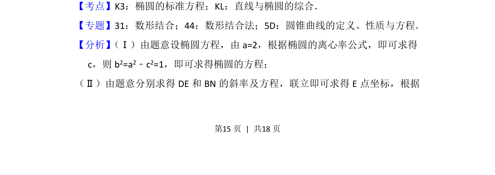
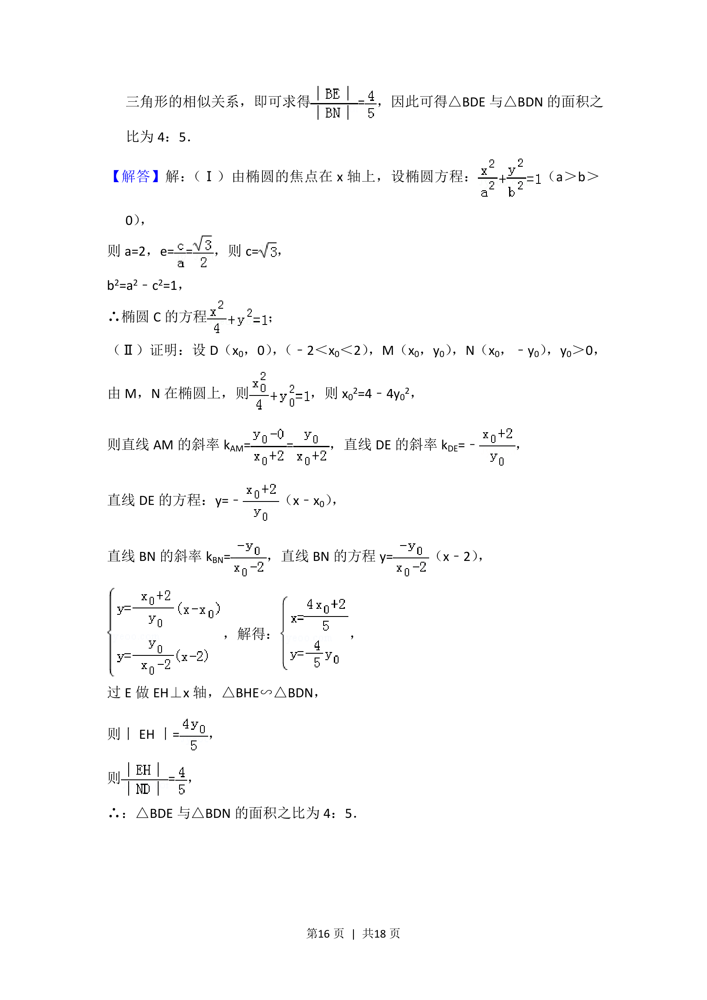
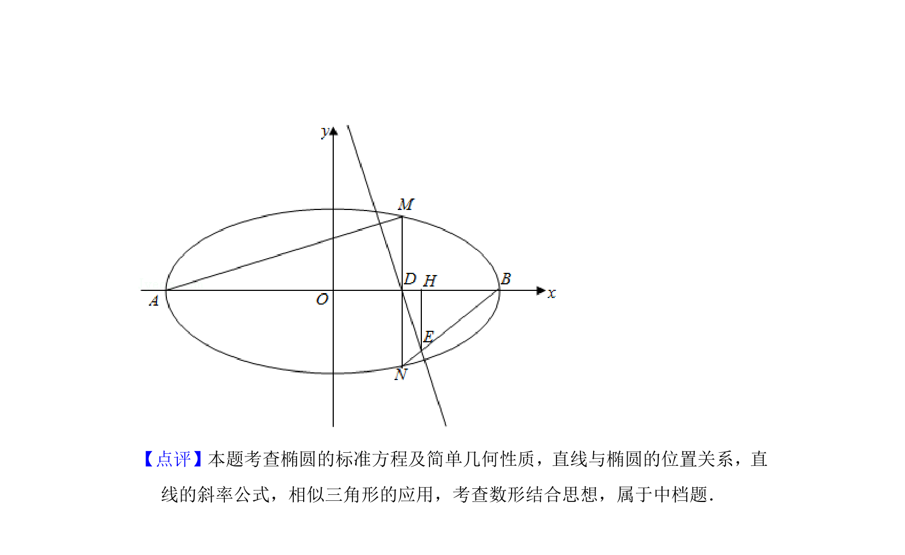

## 题面

## 摘要

已知椭圆顶点和离心率求标准方程，并证明两三角形面积比为定值

## 关联考点

- [[061-方程|椭圆的标准方程]]
- [[575-直线与椭圆综合|直线与椭圆的综合]]

## 答案与解析

> 📄 原 PDF 第 15 页：`素材/真题/北京/2008-2024·（北京）数学高考真题/2017年高考数学试卷（文）（北京）（解析卷）.pdf`

<!-- 题干文本-start -->
## 题干文本
19． （14分）已知椭圆C的两个顶点分别为A（﹣2，0） ，B（2，0） ，焦点在x
轴上，离心率为 ．
（Ⅰ）求椭圆C的方程；
（Ⅱ）点D为x轴上一点，过D作x轴的垂线交椭圆C于不同的两点M，N，
过D作AM的垂线交BN于点E．求证：△BDE与△BDN的面积之比为4：5．
<!-- 题干文本-end -->

<!-- 解析文本-start -->
## 解析文本
【考点】K3：椭圆的标准方程；KL：直线与椭圆的综合．菁优网版权所有
【专题】31：数形结合；44：数形结合法；5D：圆锥曲线的定义、性质与方程．
【分析】 （Ⅰ）由题意设椭圆方程，由a=2，根据椭圆的离心率公式，即可求得
c，则b 2=a2﹣c2=1，即可求得椭圆的方程；
（Ⅱ）由题意分别求得DE和BN的斜率及方程，联立即可求得E点坐标，根据
<!-- 解析文本-end -->
