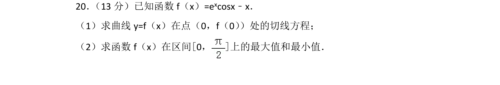
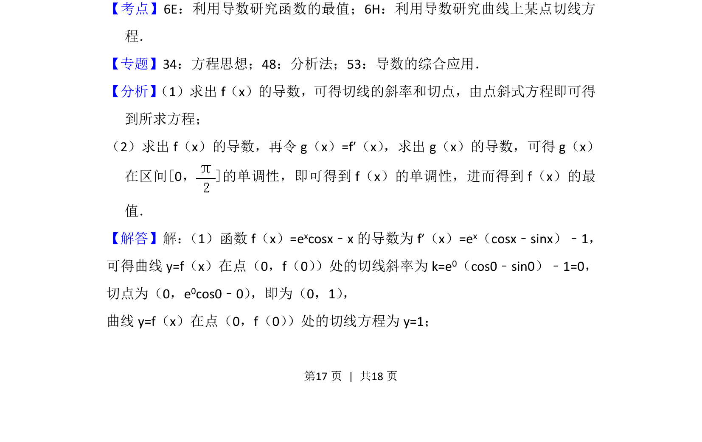
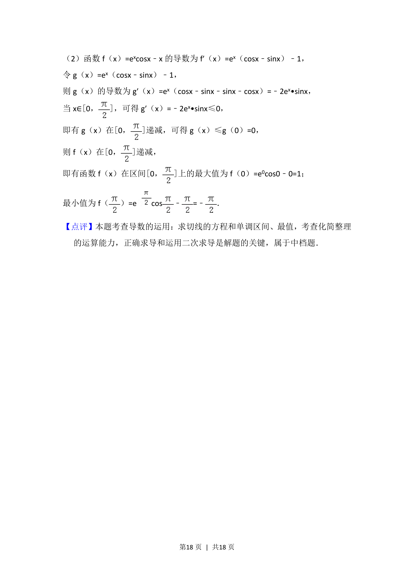

## 题面

## 摘要

求函数在点处的切线方程及区间最值，涉及导数运算与单调性分析。

## 关联考点

- [[利用导数研究函数最值]]
- [[710-利用导数研究曲线上某点切线方程|利用导数研究曲线上某点切线方程]]

## 答案与解析

> 📄 原 PDF 第 17 页：`素材/真题/北京/2008-2024·（北京）数学高考真题/2017年高考数学试卷（文）（北京）（解析卷）.pdf`
