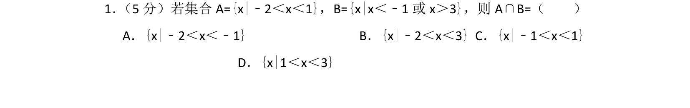
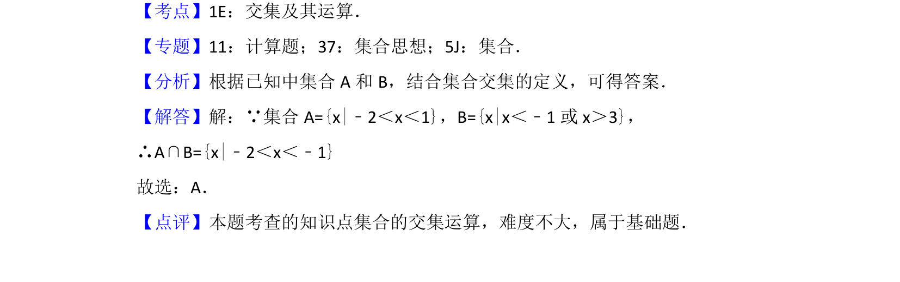

## 题面

## 摘要

求两集合并集运算，属于基础集合运算题。

## 关联考点

- [[645-交集及其运算|交集及其运算]]

## 答案与解析

> 📄 原 PDF 第 1 页：`素材/真题/北京/2008-2024·（北京）数学高考真题/2017年高考数学试卷（理）（北京）（解析卷）.pdf`

<!-- 题干文本-start -->
## 题干文本
1． （5分）若集合A={x|﹣2＜x＜1}，B={x|x＜﹣1或x＞3}，则A∩B=（　　）
A．{x|﹣2＜x＜﹣1}B．{x|﹣2＜x＜3}C．{x|﹣1＜x＜1}
D．{x|1＜x＜3}
<!-- 题干文本-end -->

<!-- 解析文本-start -->
## 解析文本
【考点】1E：交集及其运算．菁优网版权所有
【专题】11：计算题；37：集合思想；5J：集合．
【分析】根据已知中集合A和B，结合集合交集的定义，可得答案．
【解答】解：∵集合A={x|﹣2＜x＜1}，B={x|x＜﹣1或x＞3}，
∴A∩B={x|﹣2＜x＜﹣1}
故选：A．
【点评】本题考查的知识点集合的交集运算，难度不大，属于基础题．
<!-- 解析文本-end -->
