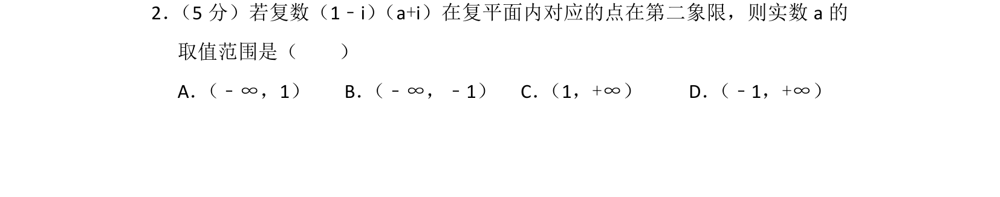
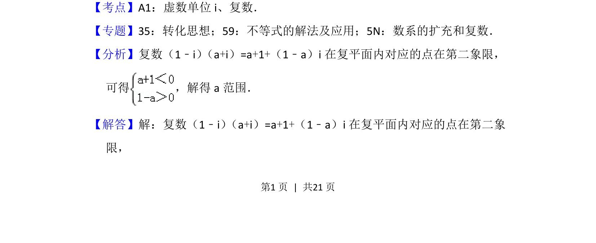
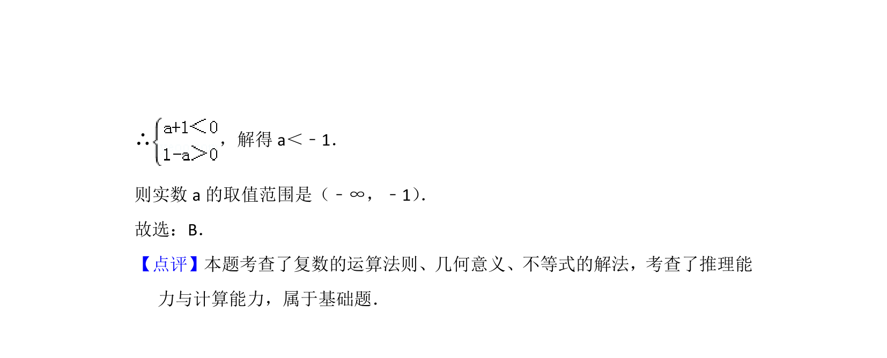

## 题面

## 摘要

复数乘法及几何意义，由对应点所在象限求参数范围。

## 关联考点

- [[1170-复数代数运算|复数代数运算]]
- [[333-复数的几何意义|复数的几何意义]]
- [[623-不等式求解|不等式求解]]

## 答案与解析

> 📄 原 PDF 第 1 页：`素材/真题/北京/2008-2024·（北京）数学高考真题/2017年高考数学试卷（理）（北京）（解析卷）.pdf`

<!-- 题干文本-start -->
## 题干文本
2． （5分）若复数（1﹣i） （a+i）在复平面内对应的点在第二象限，则实数a的
取值范围是（　　）
A． （﹣∞，1）B． （﹣∞，﹣1）C． （1，+∞）D． （﹣1，+∞）
<!-- 题干文本-end -->

<!-- 解析文本-start -->
## 解析文本
【考点】A1：虚数单位i、复数．菁优网版权所有
【专题】35：转化思想；59：不等式的解法及应用；5N：数系的扩充和复数．
【分析】复数（1﹣i） （a+i）=a+1+（1﹣a）i在复平面内对应的点在第二象限，
可得 ，解得a范围．
【解答】解：复数（1﹣i） （a+i）=a+1+（1﹣a）i在复平面内对应的点在第二象
限，
<!-- 解析文本-end -->
