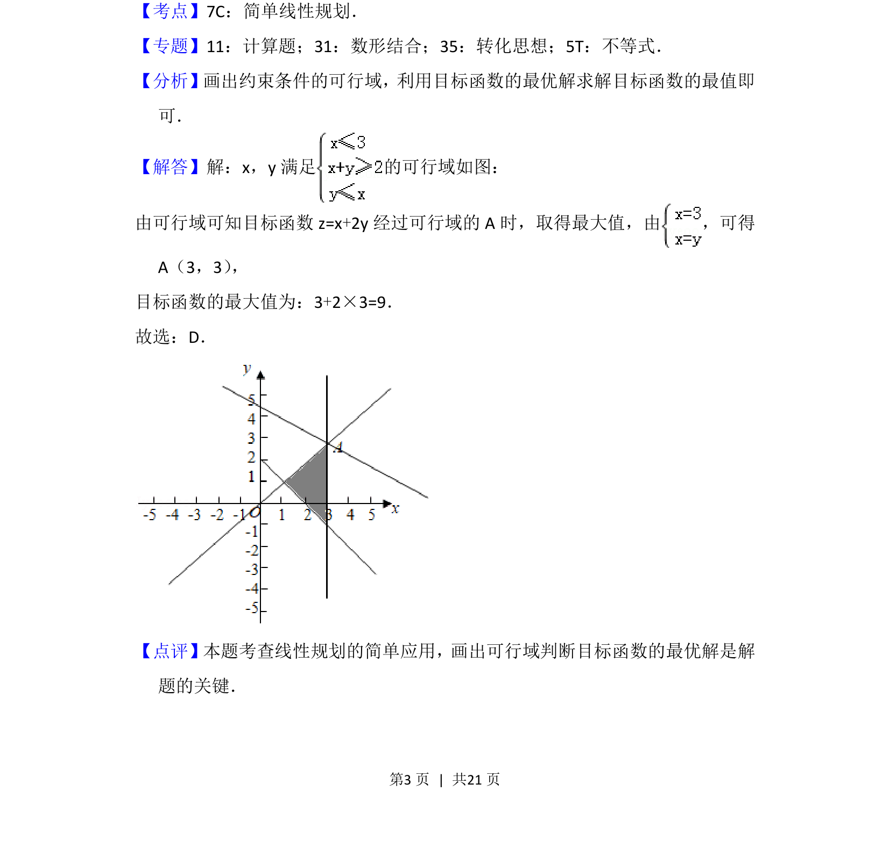

## 题面

## 摘要

线性规划问题，求可行域内目标函数的最大值。

## 关联考点

- [[1074-简单线性规划|简单线性规划]]
- [[1156-可行域|可行域]]
- [[1000-目标函数最值|目标函数最值]]
- [[897-数形结合|数形结合]]

## 答案与解析

> 📄 原 PDF 第 3 页：`素材/真题/北京/2008-2024·（北京）数学高考真题/2017年高考数学试卷（理）（北京）（解析卷）.pdf`
