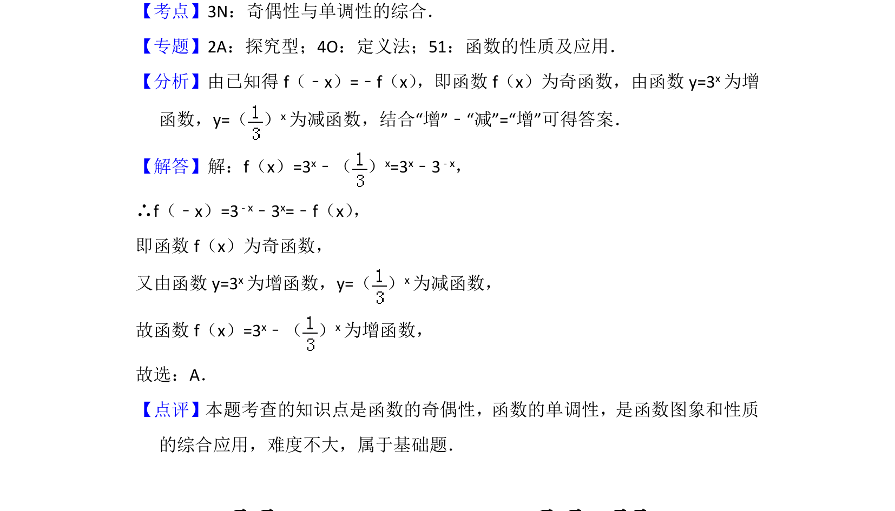

## 题面

## 摘要

函数奇偶性与单调性判断，通过解析式变形及函数增减性运算得结论

## 关联考点

- [[817-奇偶性|奇偶性]]
- [[719-单调性|单调性]]
- [[304-指数函数|指数函数]]

## 答案与解析

> 📄 原 PDF 第 4 页：`素材/真题/北京/2008-2024·（北京）数学高考真题/2017年高考数学试卷（理）（北京）（解析卷）.pdf`
