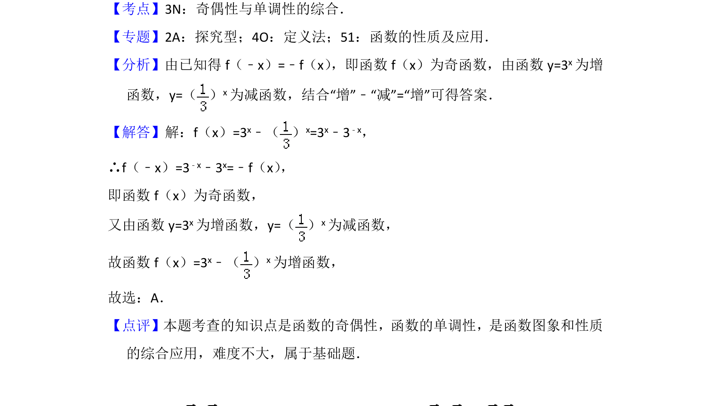

## 题面

## 摘要

函数奇偶性与单调性判断，通过解析式变形及函数增减性运算得结论

## 关联考点

- [[817-奇偶性|奇偶性]]
- [[719-单调性|单调性]]
- [[304-指数函数|指数函数]]

## 答案与解析

> 📄 原 PDF 第 4 页：`素材/真题/北京/2008-2024·（北京）数学高考真题/2017年高考数学试卷（理）（北京）（解析卷）.pdf`

<!-- 题干文本-start -->
## 题干文本
5． （5分）已知函数f（x）=3x﹣（ ） x，则f（x） （　　）
A．是奇函数，且在R上是增函数B．是偶函数，且在R上是增函数
C．是奇函数，且在R上是减函数D．是偶函数，且在R上是减函数
<!-- 题干文本-end -->

<!-- 解析文本-start -->
## 解析文本
【考点】3N：奇偶性与单调性的综合．菁优网版权所有
【专题】2A：探究型；4O：定义法；51：函数的性质及应用．
【分析】由已知得f（﹣x）=﹣f（x） ，即函数f（x）为奇函数，由函数y=3x为增
函数，y=（ ） x为减函数，结合“增”﹣“减”=“增”可得答案．
【解答】解：f（x）=3x﹣（ ） x=3x﹣3﹣x，
∴f（﹣x）=3﹣x﹣3x=﹣f（x） ，
即函数f（x）为奇函数，
又由函数y=3 x为增函数，y=（ ） x为减函数，
故函数f（x）=3 x﹣（ ） x为增函数，
故选：A．
【点评】本题考查的知识点是函数的奇偶性，函数的单调性，是函数图象和性质
的综合应用，难度不大，属于基础题．
<!-- 解析文本-end -->
