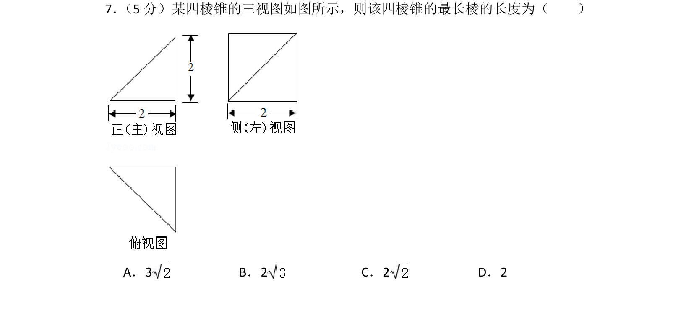
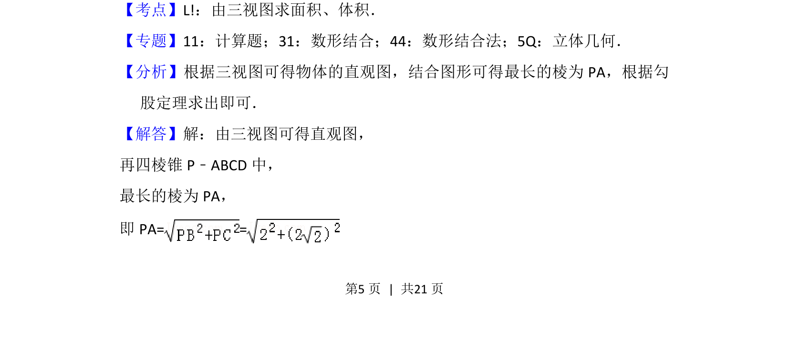
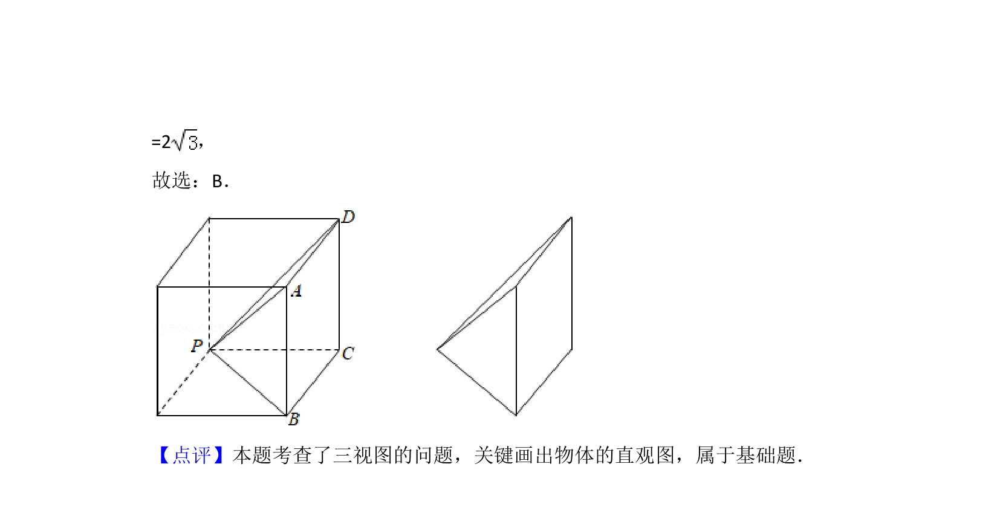

## 题面

## 摘要

由三视图还原四棱锥直观图，利用勾股定理求最长棱的长度。

## 关联考点

- [[1198-由三视图求面积|由三视图求面积]]
- [[066-体积|体积]]
- [[1200-空间几何体的直观图|直观图]]
- [[棱长]]
- [[189-勾股定理|勾股定理]]

## 答案与解析

> 📄 原 PDF 第 5 页：`素材/真题/北京/2008-2024·（北京）数学高考真题/2017年高考数学试卷（理）（北京）（解析卷）.pdf`
