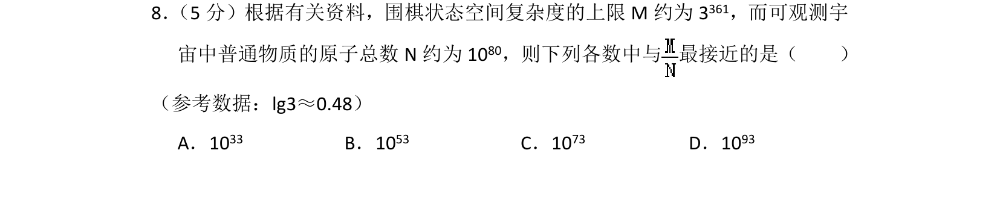
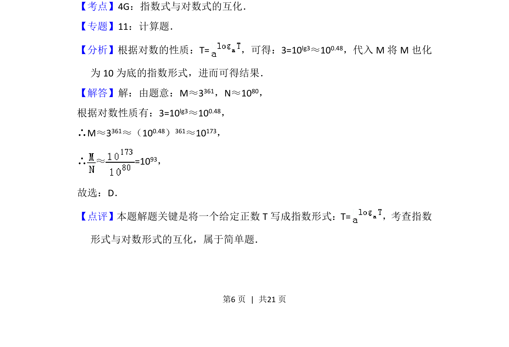

## 题面

## 摘要

本题通过比较围棋状态复杂度与原子总数，考查利用对数运算将指数形式转换并求比值的近似值。

## 关联考点

- [[1379-指数式与对数式的互化|指数式与对数式的互化]]
- [[832-对数运算|对数运算]]
- [[1380-指数运算|指数运算]]

## 答案与解析

> 📄 原 PDF 第 6 页：`素材/真题/北京/2008-2024·（北京）数学高考真题/2017年高考数学试卷（理）（北京）（解析卷）.pdf`

<!-- 题干文本-start -->
## 题干文本
8． （5分）根据有关资料，围棋状态空间复杂度的上限M约为3361，而可观测宇
宙中普通物质的原子总数N约为10 80，则下列各数中与 最接近的是（　　）
（参考数据：lg3≈0.48）
A．1033 B．1053 C．1073 D．1093
<!-- 题干文本-end -->

<!-- 解析文本-start -->
## 解析文本
【考点】4G：指数式与对数式的互化．菁优网版权所有
【专题】11：计算题．
【分析】根据对数的性质：T=，可得：3=10 lg3≈100.48，代入M将M也化
为10为底的指数形式，进而可得结果．
【解答】解：由题意：M≈3361，N≈1080，
根据对数性质有：3=10lg3≈100.48，
∴M≈3361≈（100.48）361≈10173，
∴ ≈=10 93，
故选：D．
【点评】本题解题关键是将一个给定正数T写成指数形式：T=，考查指数
形式与对数形式的互化，属于简单题．
<!-- 解析文本-end -->
