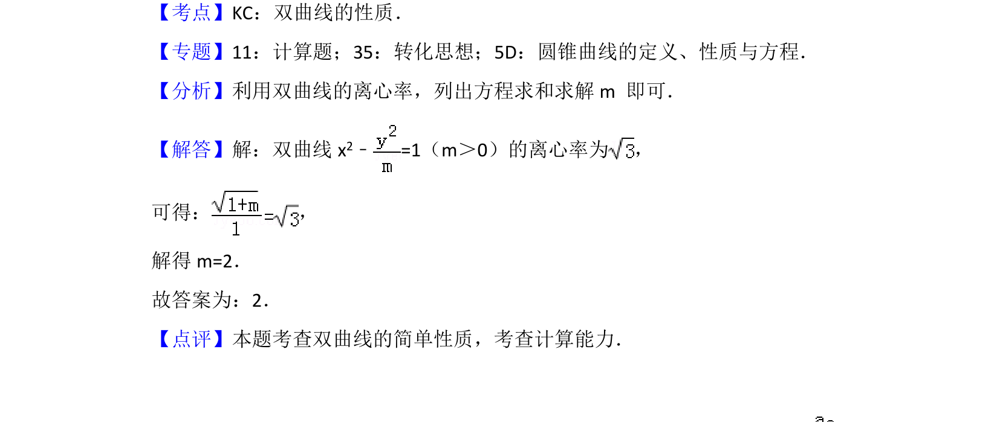

## 题面

## 摘要

利用双曲线方程及离心率公式求解参数m的值。

## 关联考点

- [[731-双曲线的性质|双曲线的性质]]
- [[391-椭圆离心率|离心率]]

## 答案与解析

> 📄 原 PDF 第 7 页：`素材/真题/北京/2008-2024·（北京）数学高考真题/2017年高考数学试卷（理）（北京）（解析卷）.pdf`

<!-- 题干文本-start -->
## 题干文本
9． （5分）若双曲线x2﹣=1的离心率为 ，则实数m=　2　．
<!-- 题干文本-end -->

<!-- 解析文本-start -->
## 解析文本
【考点】KC：双曲线的性质．菁优网版权所有
【专题】11：计算题；35：转化思想；5D：圆锥曲线的定义、性质与方程．
【分析】利用双曲线的离心率，列出方程求和求解m 即可．
【解答】解：双曲线x 2﹣=1（m＞0）的离心率为 ，
可得： ，
解得m=2．
故答案为：2．
【点评】本题考查双曲线的简单性质，考查计算能力．
<!-- 解析文本-end -->
