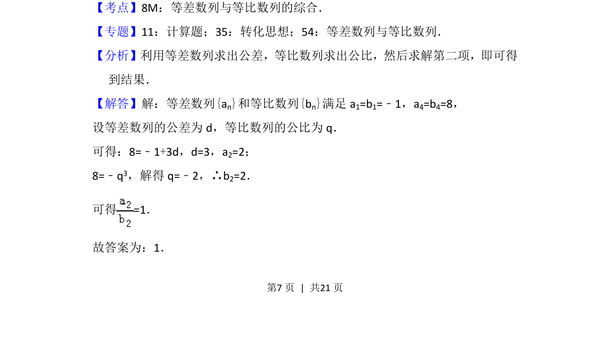
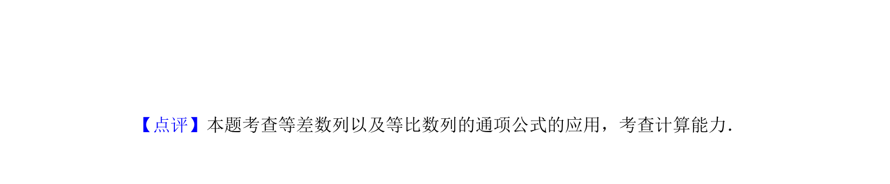

## 题面

## 摘要

考查等差数列与等比数列基本量的计算，已知首项和第四项求公差、公比及第二项比值。

## 关联考点

- [[356-等差数列概念|等差数列]]
- [[1067-等比数列的定义与通项公式|等比数列]]
- [[基本量运算]]

## 答案与解析

> 📄 原 PDF 第 7 页：`素材/真题/北京/2008-2024·（北京）数学高考真题/2017年高考数学试卷（理）（北京）（解析卷）.pdf`
