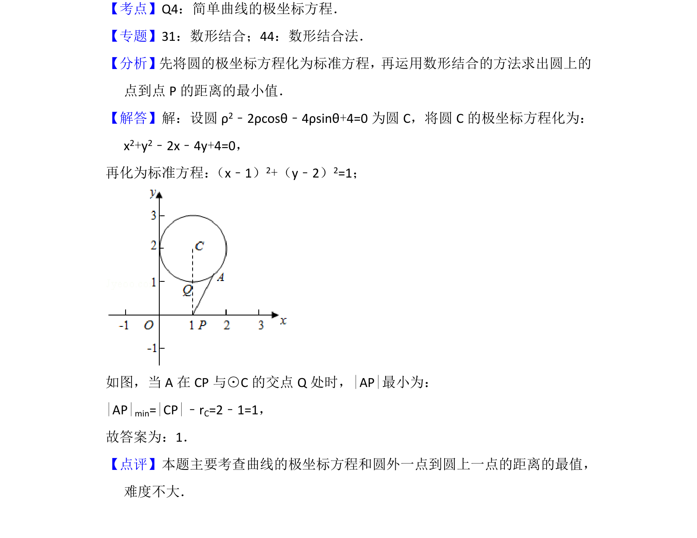

## 题面

## 摘要

极坐标方程化直角坐标方程，圆外一点到圆上点距离的最小值计算。

## 关联考点

- [[921-极坐标方程|极坐标方程]]
- [[782-圆的方程|圆的方程]]
- [[距离最值]]

## 答案与解析

> 📄 原 PDF 第 8 页：`素材/真题/北京/2008-2024·（北京）数学高考真题/2017年高考数学试卷（理）（北京）（解析卷）.pdf`

<!-- 题干文本-start -->
## 题干文本
11． （5分）在极坐标系中，点A在圆ρ 2﹣2ρcosθ﹣4ρsinθ+4=0上，点P的坐标
为（1，0） ，则|AP|的最小值为　1　．
<!-- 题干文本-end -->

<!-- 解析文本-start -->
## 解析文本
【考点】Q4：简单曲线的极坐标方程．菁优网版权所有
【专题】31：数形结合；44：数形结合法．
【分析】先将圆的极坐标方程化为标准方程，再运用数形结合的方法求出圆上的
点到点P的距离的最小值．
【解答】解：设圆ρ 2﹣2ρcosθ﹣4ρsinθ+4=0为圆C，将圆C的极坐标方程化为：
x2+y2﹣2x﹣4y+4=0，
再化为标准方程： （x﹣1）2+（y﹣2）2=1；
如图，当A在CP与⊙C的交点Q处时，|AP|最小为：
|AP|min=|CP|﹣rC=2﹣1=1，
故答案为：1．
【点评】本题主要考查曲线的极坐标方程和圆外一点到圆上一点的距离的最值，
难度不大．
<!-- 解析文本-end -->
