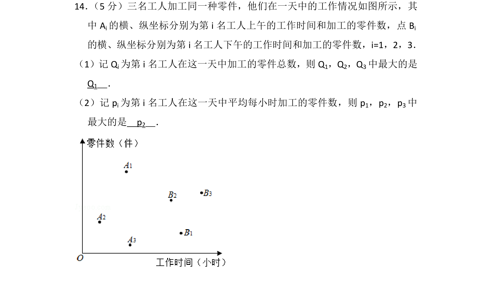
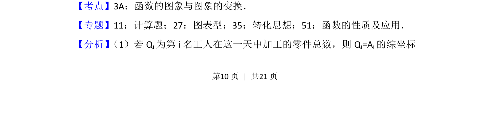
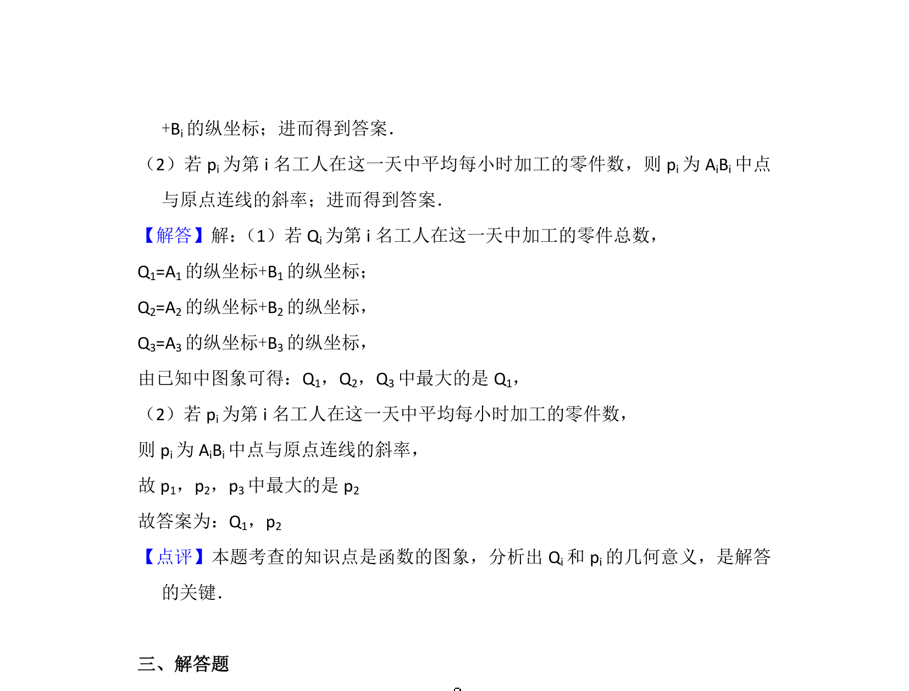

## 题面

## 摘要

根据工人工作时间和加工零件数的函数图象，比较零件总数与加工效率的最值。

## 关联考点

- [[689-函数的图象与图象的变换|函数的图象与图象的变换]]
- [[899-数据分析|数据分析]]
- [[913-最值问题|最值问题]]

## 答案与解析

> 📄 原 PDF 第 10 页：`素材/真题/北京/2008-2024·（北京）数学高考真题/2017年高考数学试卷（理）（北京）（解析卷）.pdf`
