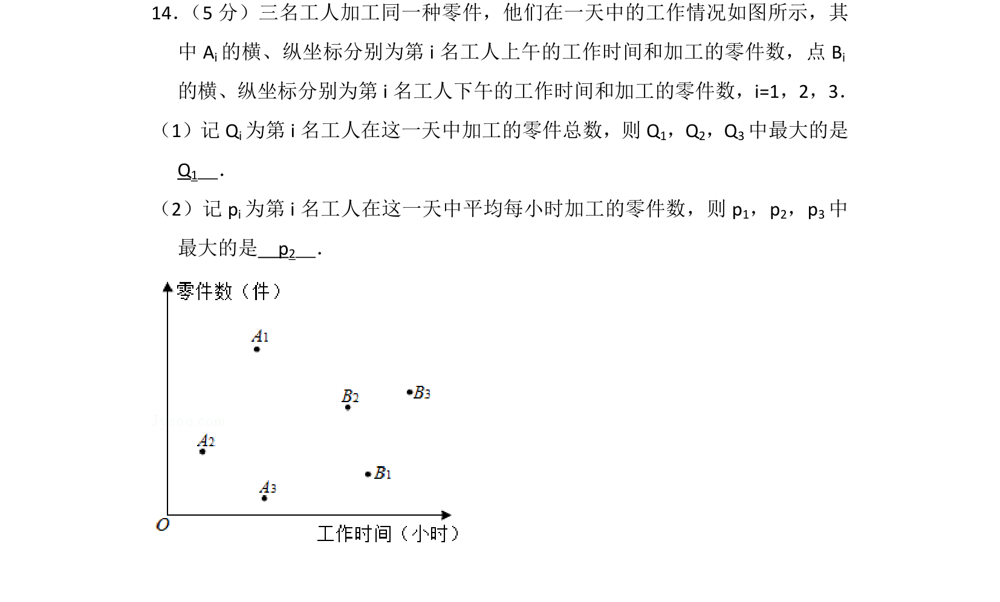
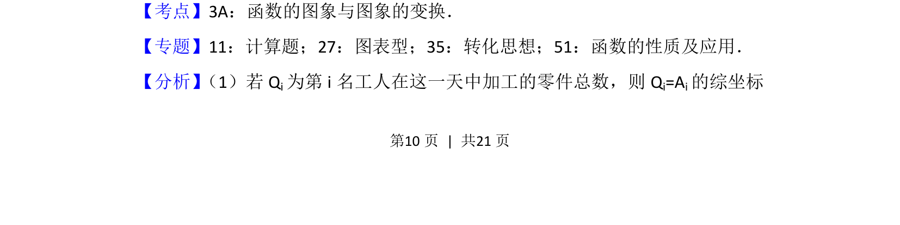
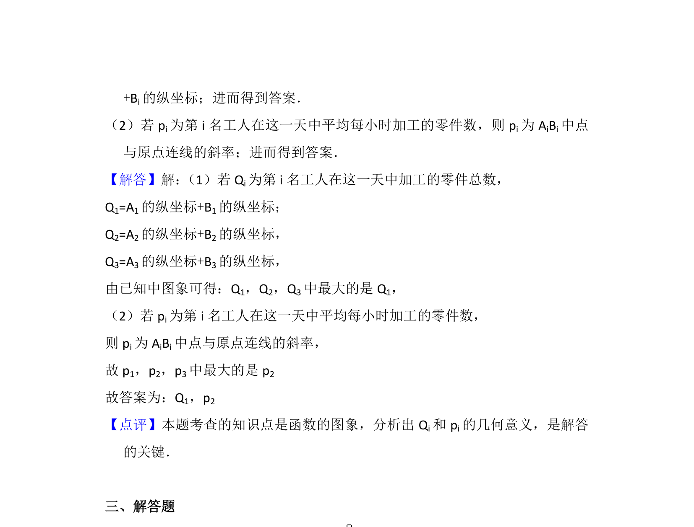

## 题面

## 摘要

根据工人工作时间和加工零件数的函数图象，比较零件总数与加工效率的最值。

## 关联考点

- [[689-函数的图象与图象的变换|函数的图象与图象的变换]]
- [[899-数据分析|数据分析]]
- [[913-最值问题|最值问题]]

## 答案与解析

> 📄 原 PDF 第 10 页：`素材/真题/北京/2008-2024·（北京）数学高考真题/2017年高考数学试卷（理）（北京）（解析卷）.pdf`

<!-- 题干文本-start -->
## 题干文本
14． （5分）三名工人加工同一种零件，他们在一天中的工作情况如图所示，其
中A i的横、纵坐标分别为第i名工人上午的工作时间和加工的零件数，点B i
的横、纵坐标分别为第i名工人下午的工作时间和加工的零件数，i=1，2，3．
（1）记Q i为第i名工人在这一天中加工的零件总数，则Q 1，Q2，Q3中最大的是　
Q1　．
（2）记p i为第i名工人在这一天中平均每小时加工的零件数，则p 1，p2，p3中
最大的是　p2　．
<!-- 题干文本-end -->

<!-- 解析文本-start -->
## 解析文本
【考点】3A：函数的图象与图象的变换．菁优网版权所有
【专题】11：计算题；27：图表型；35：转化思想；51：函数的性质及应用．
【分析】 （1）若Qi为第i名工人在这一天中加工的零件总数，则Q i=Ai的综坐标
<!-- 解析文本-end -->
