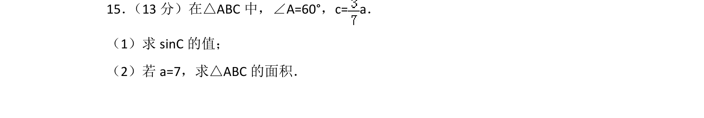
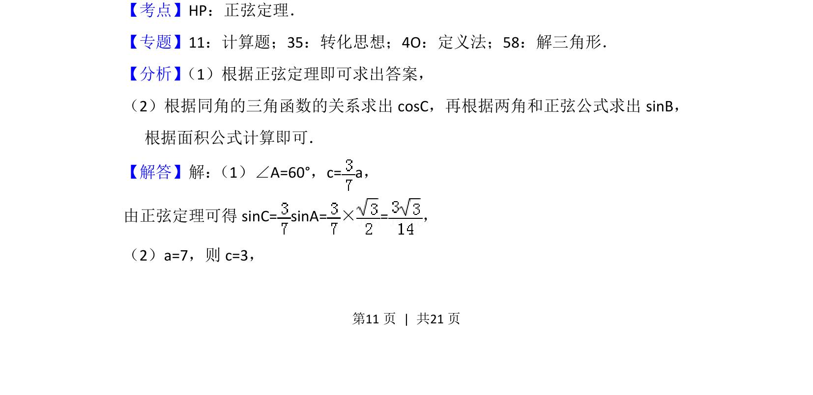
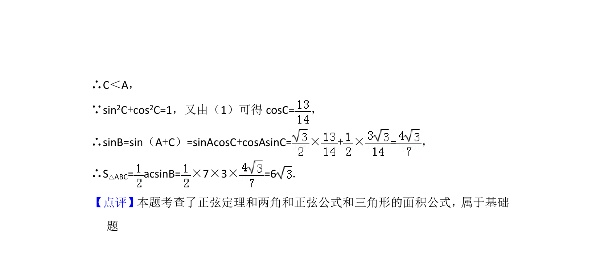

## 题面

## 摘要

在△ABC中，已知一角及边关系，用正弦定理求角的正弦值，再求三角形面积。

## 关联考点

- [[126-定理|正弦定理]]
- [[619-三角形面积公式|三角形面积公式]]
- [[632-两角和正弦公式|两角和正弦公式]]

## 答案与解析

> 📄 原 PDF 第 11 页：`素材/真题/北京/2008-2024·（北京）数学高考真题/2017年高考数学试卷（理）（北京）（解析卷）.pdf`
