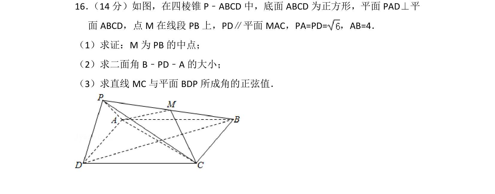
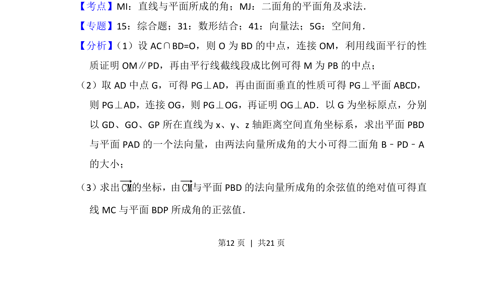
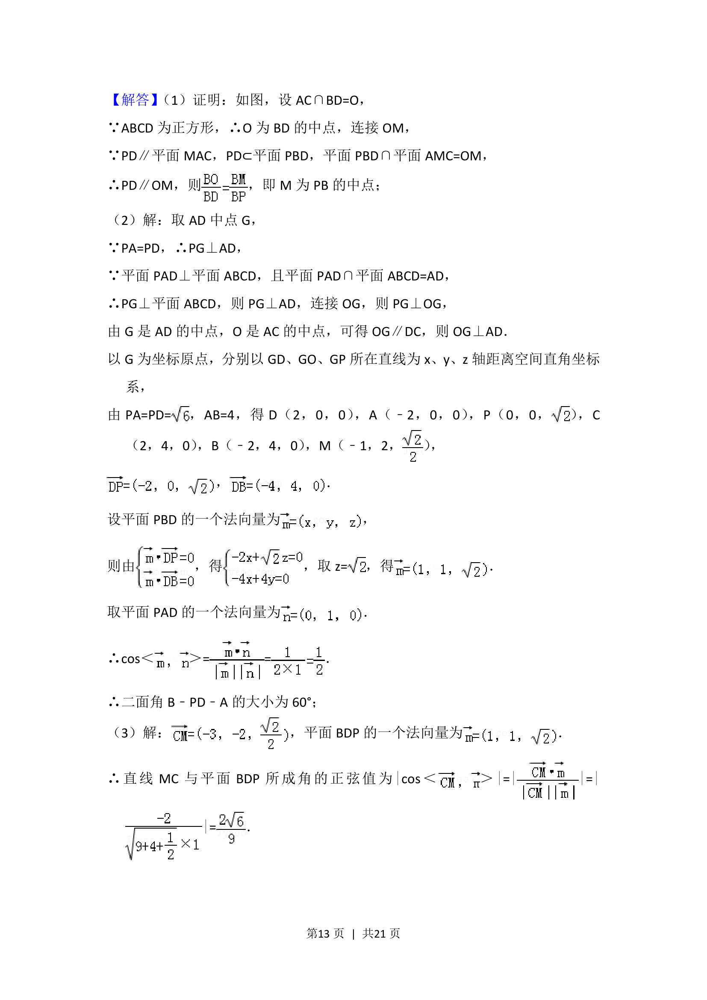
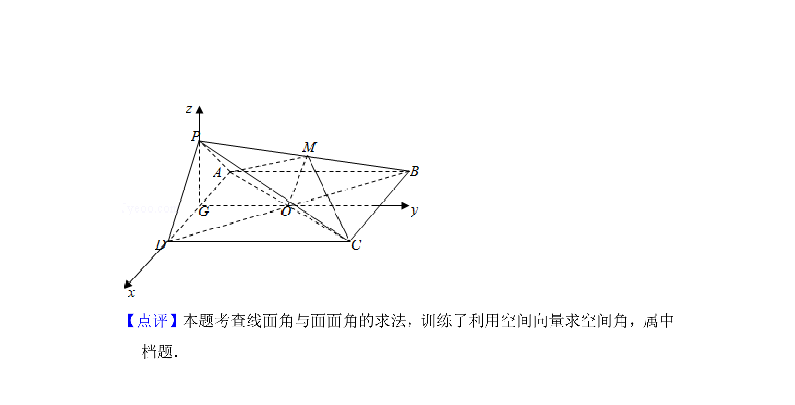

## 题面

## 摘要

在四棱锥中利用线面平行性质证明中点，并建立空间直角坐标系求解二面角和线面角正弦值。

## 关联考点

- [[1013-直线与平面所成的角|直线与平面所成的角]]
- [[643-二面角的平面角及求法|二面角的平面角及求法]]

## 答案与解析

> 📄 原 PDF 第 12 页：`素材/真题/北京/2008-2024·（北京）数学高考真题/2017年高考数学试卷（理）（北京）（解析卷）.pdf`
