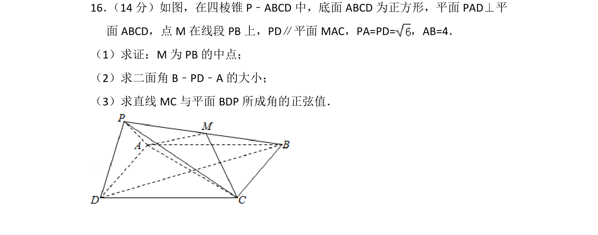
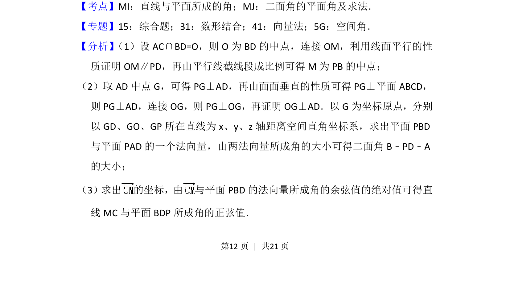
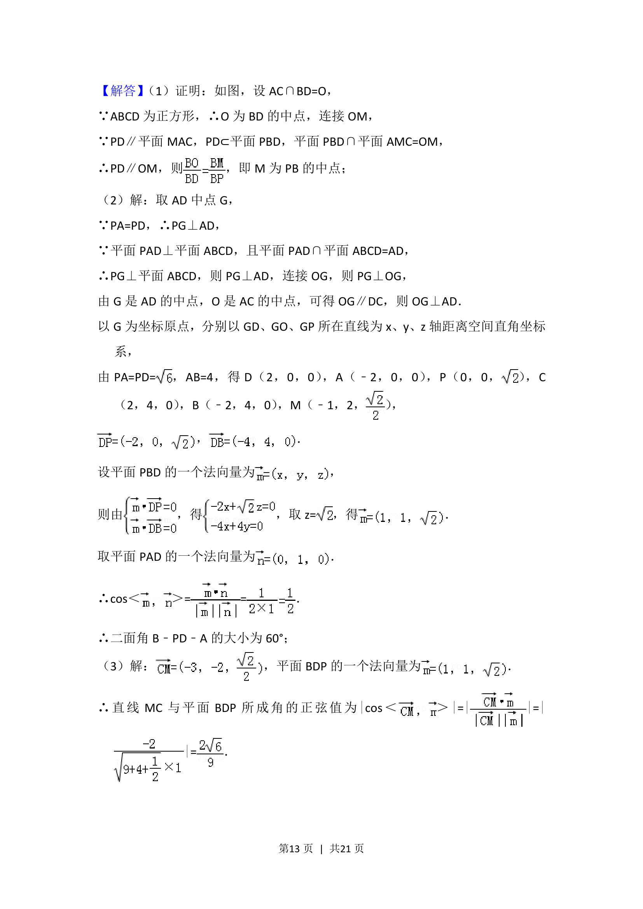
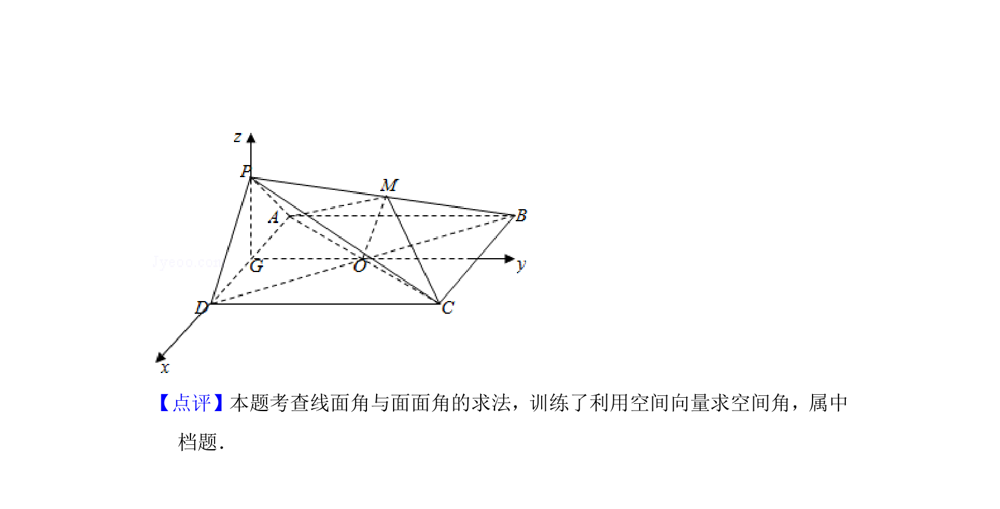

## 题面

## 摘要

在四棱锥中利用线面平行性质证明中点，并建立空间直角坐标系求解二面角和线面角正弦值。

## 关联考点

- [[1013-直线与平面所成的角|直线与平面所成的角]]
- [[643-二面角的平面角及求法|二面角的平面角及求法]]

## 答案与解析

> 📄 原 PDF 第 12 页：`素材/真题/北京/2008-2024·（北京）数学高考真题/2017年高考数学试卷（理）（北京）（解析卷）.pdf`

<!-- 题干文本-start -->
## 题干文本
16． （14分）如图，在四棱锥P﹣ABCD中，底面ABCD为正方形，平面PAD⊥平
面ABCD，点M在线段PB上，PD∥平面MAC，PA=PD=，AB=4．
（1）求证：M为PB的中点；
（2）求二面角B﹣PD﹣A的大小；
（3）求直线MC与平面BDP所成角的正弦值．
<!-- 题干文本-end -->

<!-- 解析文本-start -->
## 解析文本
【考点】MI：直线与平面所成的角；MJ：二面角的平面角及求法．菁优网版权所有
【专题】15：综合题；31：数形结合；41：向量法；5G：空间角．
【分析】 （1）设AC∩BD=O，则O为BD的中点，连接OM，利用线面平行的性
质证明OM∥PD，再由平行线截线段成比例可得M为PB的中点；
（2）取AD中点G，可得PG⊥AD，再由面面垂直的性质可得PG⊥平面ABCD，
则PG⊥AD，连接OG，则PG⊥OG，再证明OG⊥AD．以G为坐标原点，分别
以GD、GO、GP所在直线为x、y、z轴距离空间直角坐标系，求出平面PBD
与平面PAD的一个法向量，由两法向量所成角的大小可得二面角B﹣PD﹣A
的大小；
（3）求出 的坐标，由 与平面PBD的法向量所成角的余弦值的绝对值可得直
线MC与平面BDP所成角的正弦值．
<!-- 解析文本-end -->
