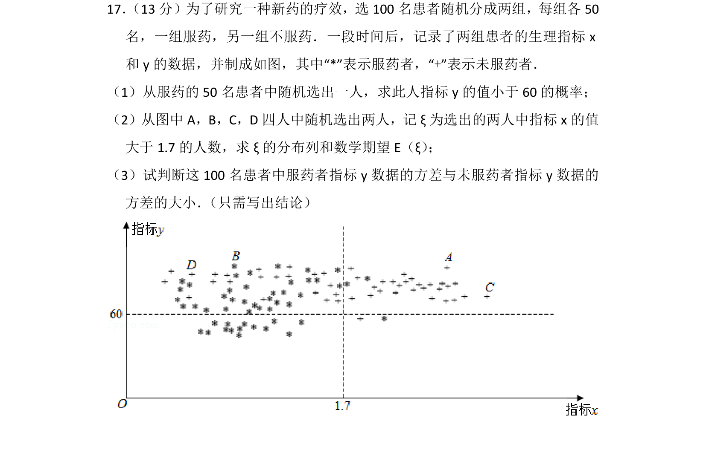
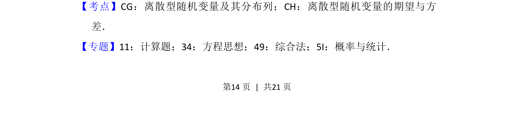
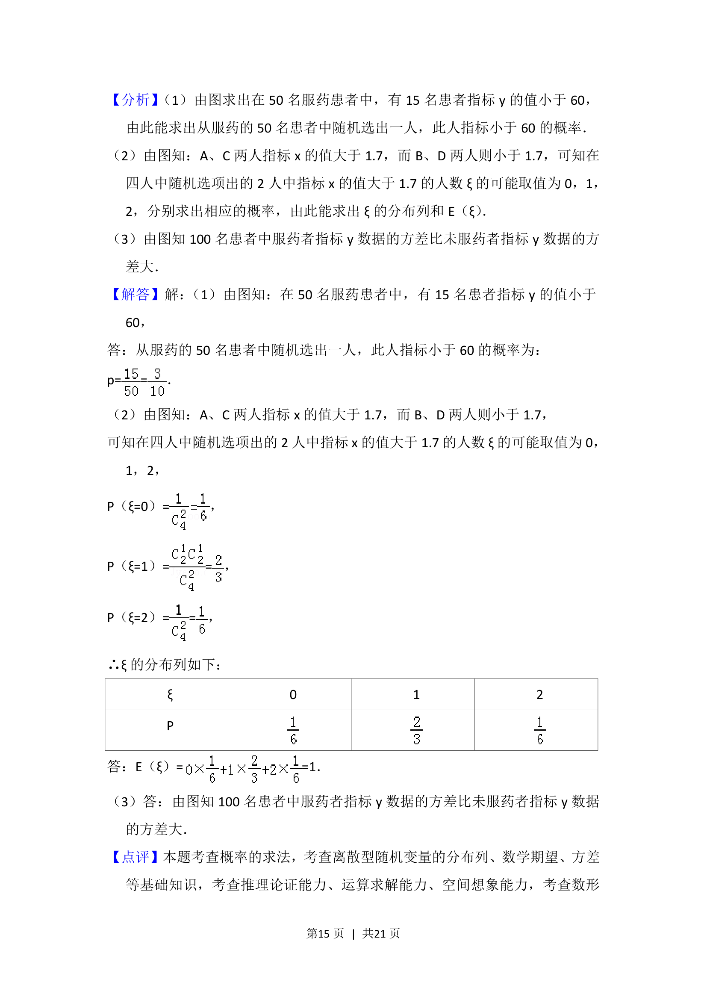

## 题面

## 摘要

研究新药疗效，从服药/未服药患者指标图中计算概率、分布列与期望，比较方差。

## 关联考点

- [[320-古典概型|古典概型]]
- [[1039-离散型随机变量分布列|离散型随机变量分布列]]
- [[1040-离散型随机变量的期望|数学期望]]
- [[198-方差|方差]]

## 答案与解析

> 📄 原 PDF 第 14 页：`素材/真题/北京/2008-2024·（北京）数学高考真题/2017年高考数学试卷（理）（北京）（解析卷）.pdf`
