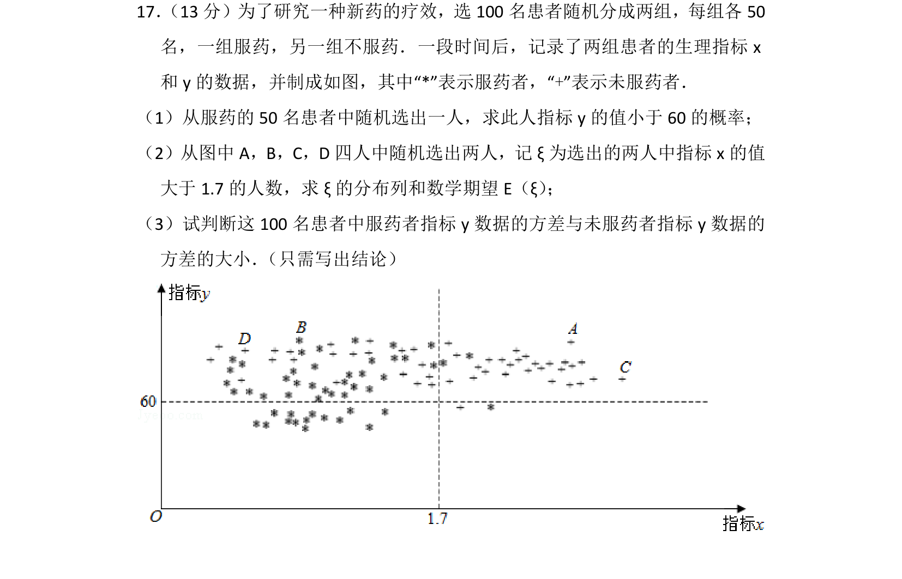
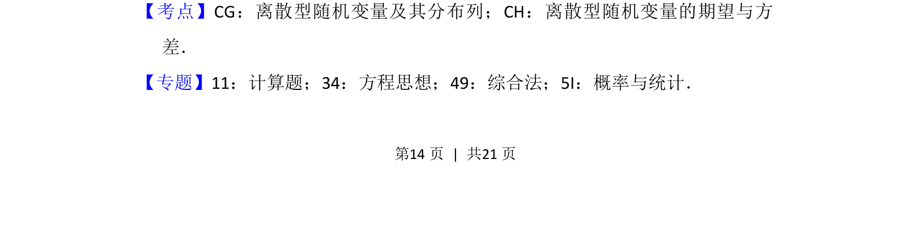
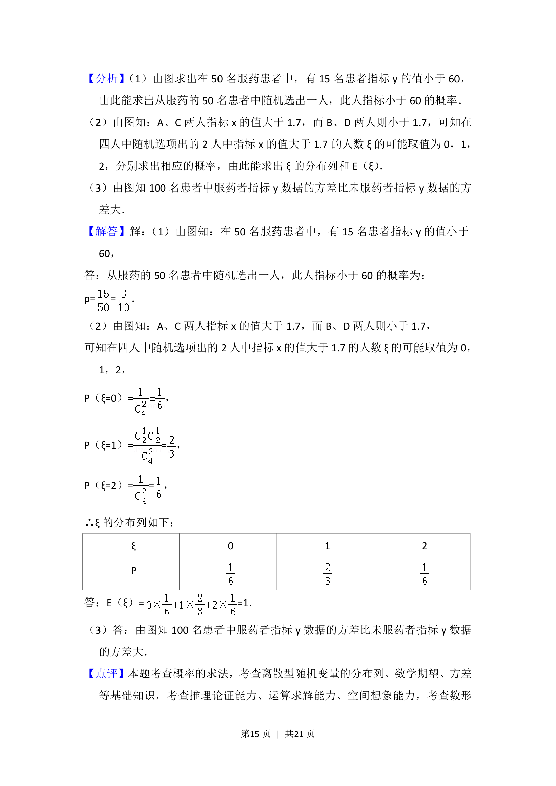

## 题面

## 摘要

研究新药疗效，从服药/未服药患者指标图中计算概率、分布列与期望，比较方差。

## 关联考点

- [[320-古典概型|古典概型]]
- [[1038-离散型随机变量分布列|离散型随机变量分布列]]
- [[501-离散型随机变量期望|数学期望]]
- [[198-方差|方差]]

## 答案与解析

> 📄 原 PDF 第 14 页：`素材/真题/北京/2008-2024·（北京）数学高考真题/2017年高考数学试卷（理）（北京）（解析卷）.pdf`

<!-- 题干文本-start -->
## 题干文本
17． （13分）为了研究一种新药的疗效，选100名患者随机分成两组，每组各50
名，一组服药，另一组不服药．一段时间后，记录了两组患者的生理指标x
和y的数据，并制成如图，其中“*”表示服药者，“+”表示未服药者．
（1）从服药的50名患者中随机选出一人，求此人指标y的值小于60的概率；
（2）从图中A，B，C，D四人中随机选出两人，记ξ为选出的两人中指标x的值
大于1.7的人数，求ξ的分布列和数学期望E（ξ） ；
（3）试判断这100名患者中服药者指标y数据的方差与未服药者指标y数据的
方差的大小． （只需写出结论）
<!-- 题干文本-end -->

<!-- 解析文本-start -->
## 解析文本
【考点】CG：离散型随机变量及其分布列；CH：离散型随机变量的期望与方
差．菁优网版权所有
【专题】11：计算题；34：方程思想；49：综合法；5I：概率与统计．
<!-- 解析文本-end -->
