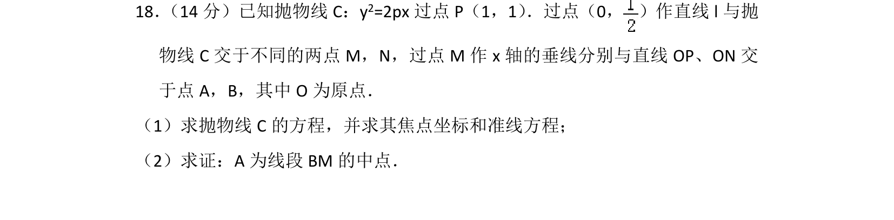
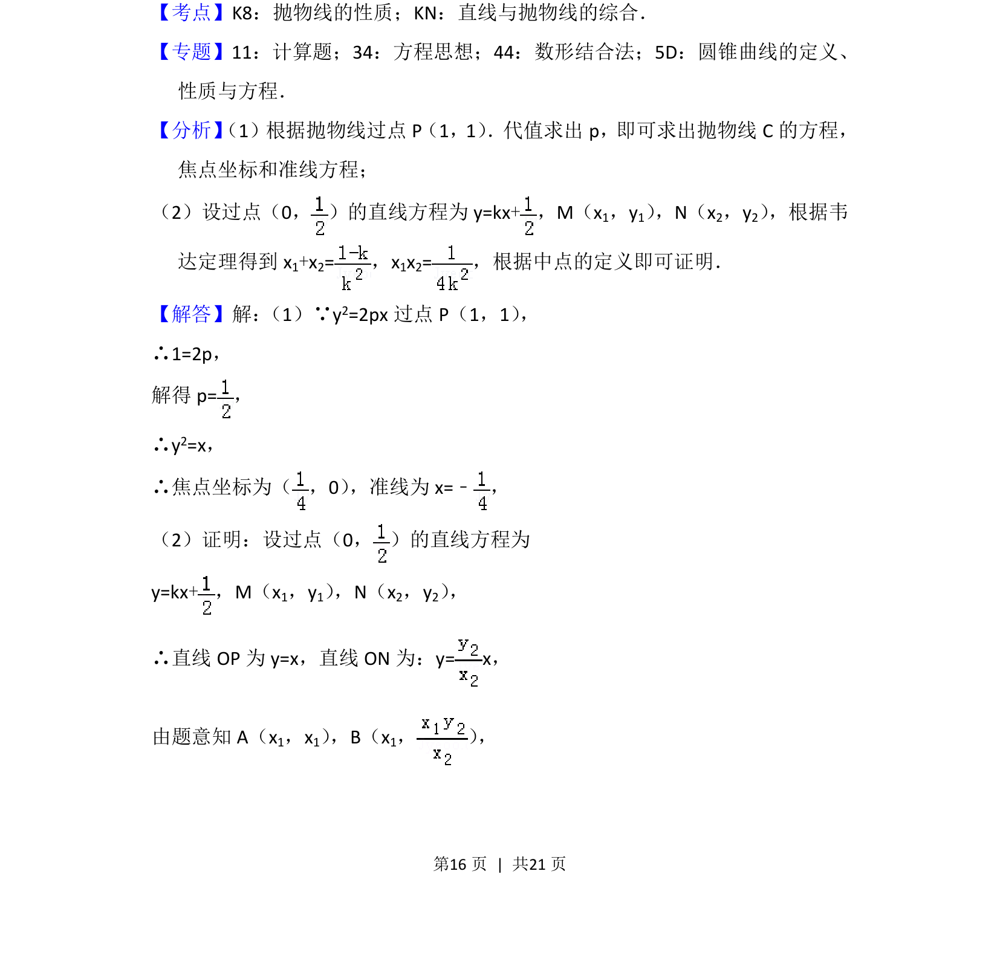
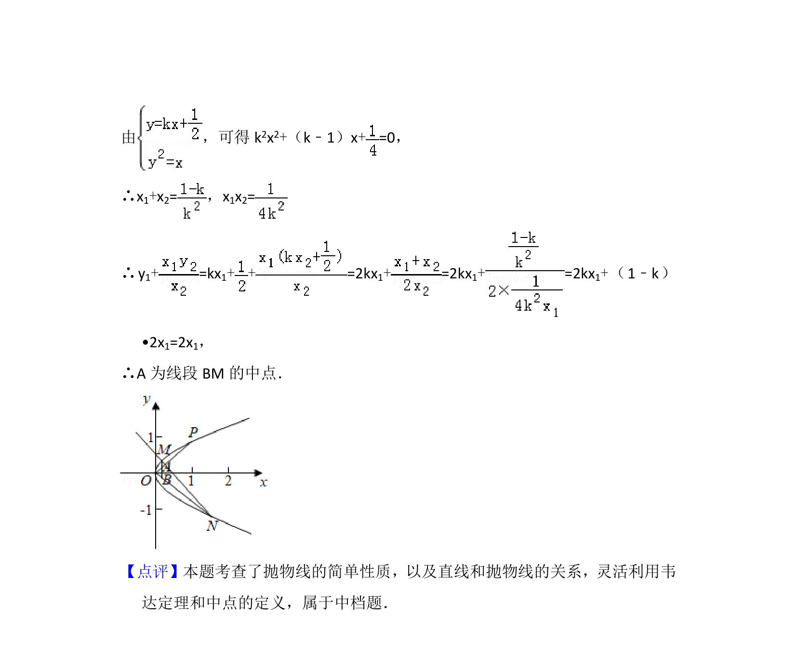

## 题面

## 摘要

抛物线标准方程求解及焦点准线推导，结合直线与抛物线位置关系证明线段中点问题。

## 关联考点

- [[879-抛物线的性质|抛物线的性质]]
- [[1018-直线与抛物线的综合|直线与抛物线的综合]]
- [[234-韦达定理-初中|韦达定理]]
- [[635-中点坐标公式|中点坐标公式]]

## 答案与解析

> 📄 原 PDF 第 16 页：`素材/真题/北京/2008-2024·（北京）数学高考真题/2017年高考数学试卷（理）（北京）（解析卷）.pdf`
