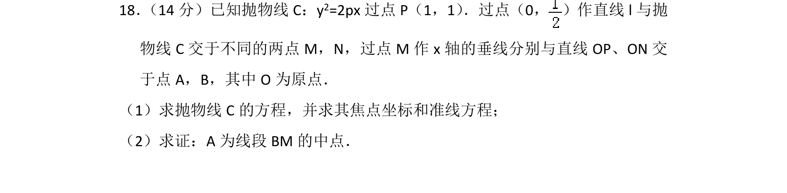
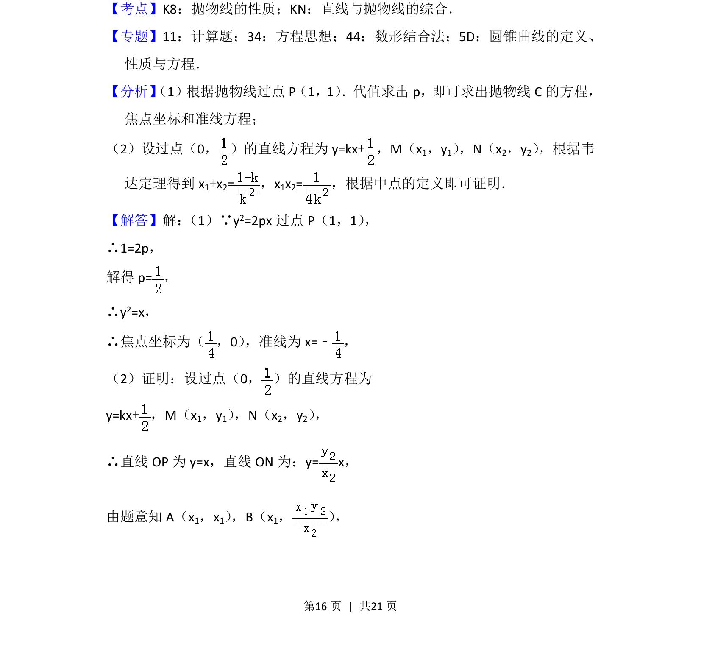
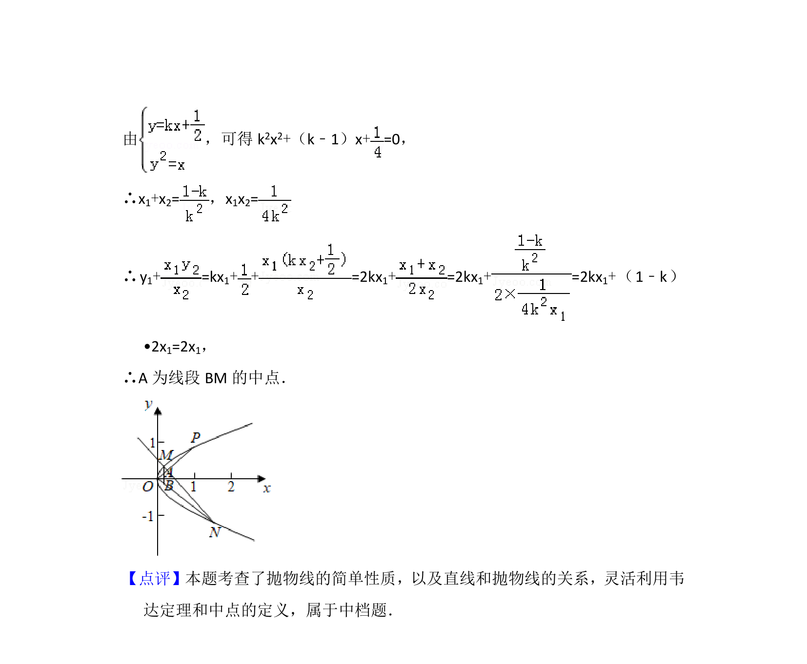

## 题面

## 摘要

抛物线标准方程求解及焦点准线推导，结合直线与抛物线位置关系证明线段中点问题。

## 关联考点

- [[879-抛物线的性质|抛物线的性质]]
- [[1018-直线与抛物线的综合|直线与抛物线的综合]]
- [[234-韦达定理-初中|韦达定理]]
- [[635-中点坐标公式|中点坐标公式]]

## 答案与解析

> 📄 原 PDF 第 16 页：`素材/真题/北京/2008-2024·（北京）数学高考真题/2017年高考数学试卷（理）（北京）（解析卷）.pdf`

<!-- 题干文本-start -->
## 题干文本
18． （14分）已知抛物线C：y2=2px过点P（1，1） ．过点（0， ）作直线l与抛
物线C交于不同的两点M，N，过点M作x轴的垂线分别与直线OP、ON交
于点A，B，其中O为原点．
（1）求抛物线C的方程，并求其焦点坐标和准线方程；
（2）求证：A为线段BM的中点．
<!-- 题干文本-end -->

<!-- 解析文本-start -->
## 解析文本
【考点】K8：抛物线的性质；KN：直线与抛物线的综合．菁优网版权所有
【专题】11：计算题；34：方程思想；44：数形结合法；5D：圆锥曲线的定义、
性质与方程．
【分析】 （1）根据抛物线过点P（1，1） ．代值求出p，即可求出抛物线C的方程，
焦点坐标和准线方程；
（2）设过点（0， ）的直线方程为y=kx+，M（x 1，y1） ，N（x2，y2） ，根据韦
达定理得到x 1+x2=，x 1x2=，根据中点的定义即可证明．
【解答】解： （1）∵y2=2px过点P（1，1） ，
∴1=2p，
解得p=，
∴y2=x，
∴焦点坐标为（ ，0） ，准线为x=﹣，
（2）证明：设过点（0， ）的直线方程为
y=kx+，M（x 1，y1） ，N（x2，y2） ，
∴直线OP为y=x，直线ON为：y= x，
由题意知A（x 1，x1） ，B（x1， ） ，
<!-- 解析文本-end -->
