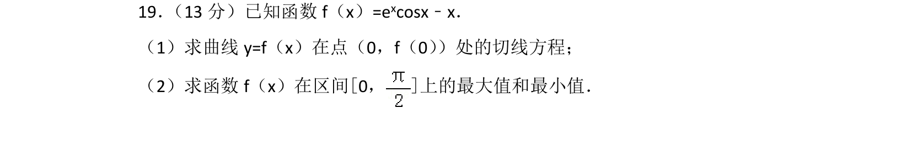
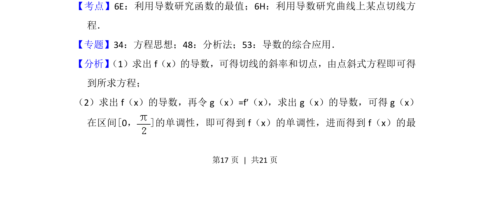
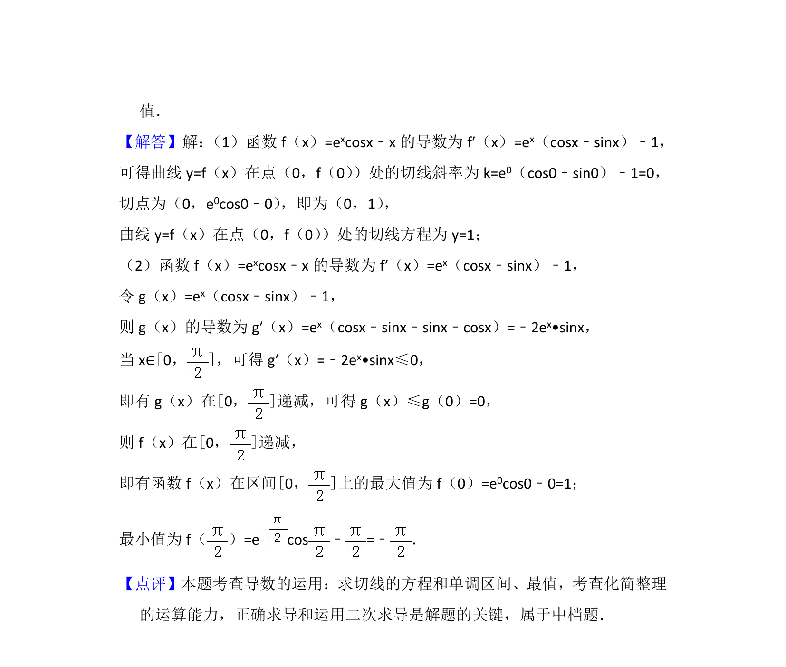

## 题面

## 摘要

含指数与余弦的函数，求切线方程及闭区间上的最值。

## 关联考点

- [[706-利用导数研究函数的最值|利用导数研究函数的最值]]
- [[710-利用导数研究曲线上某点切线方程|利用导数研究曲线上某点切线方程]]

## 答案与解析

> 📄 原 PDF 第 17 页：`素材/真题/北京/2008-2024·（北京）数学高考真题/2017年高考数学试卷（理）（北京）（解析卷）.pdf`
